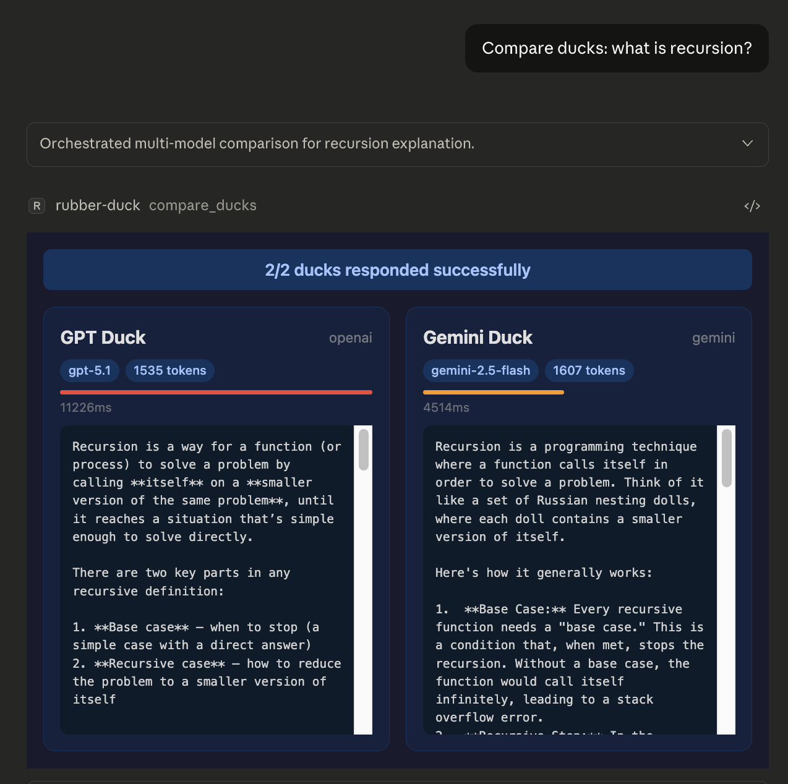
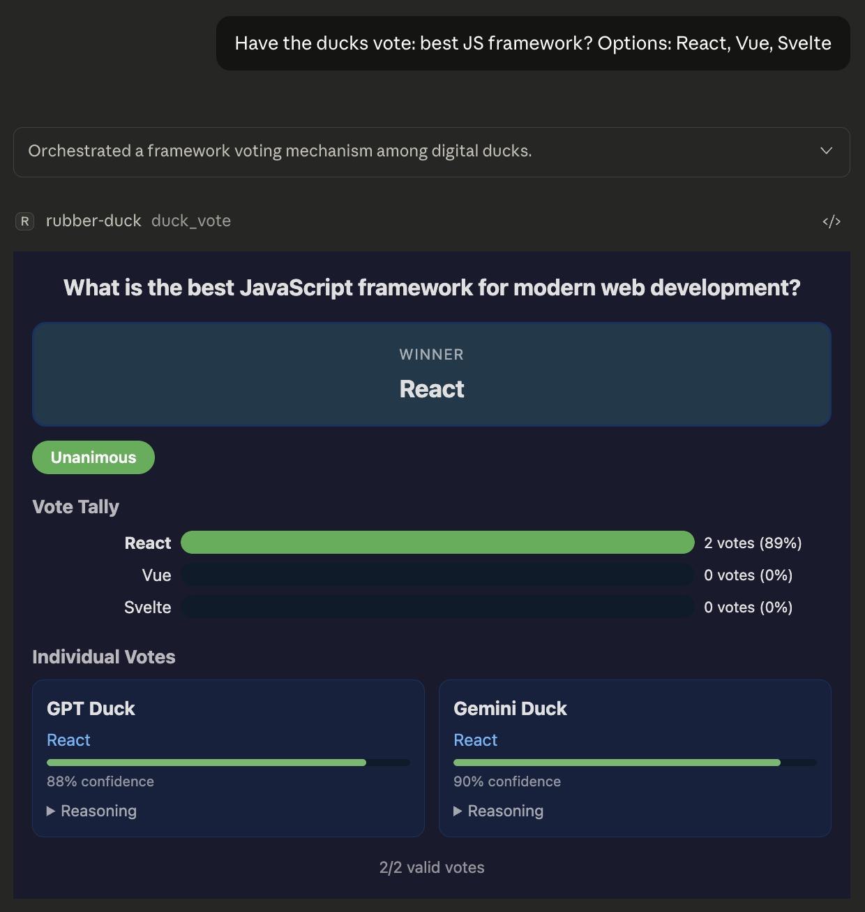
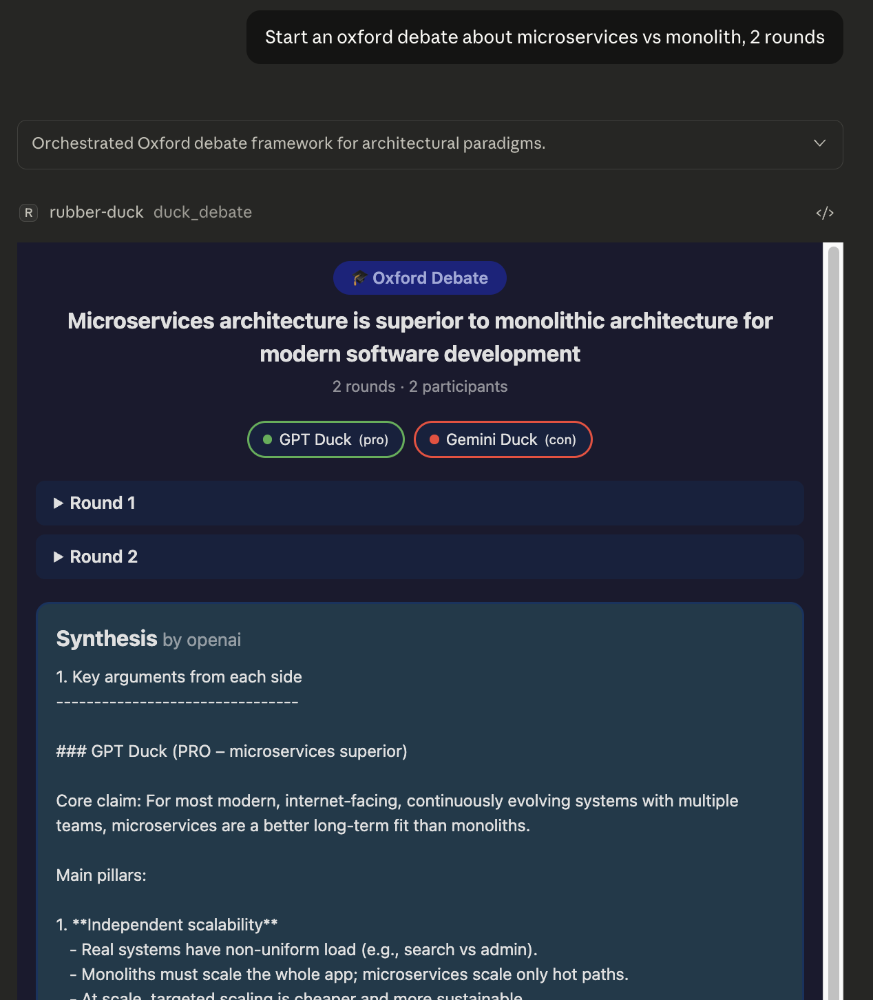
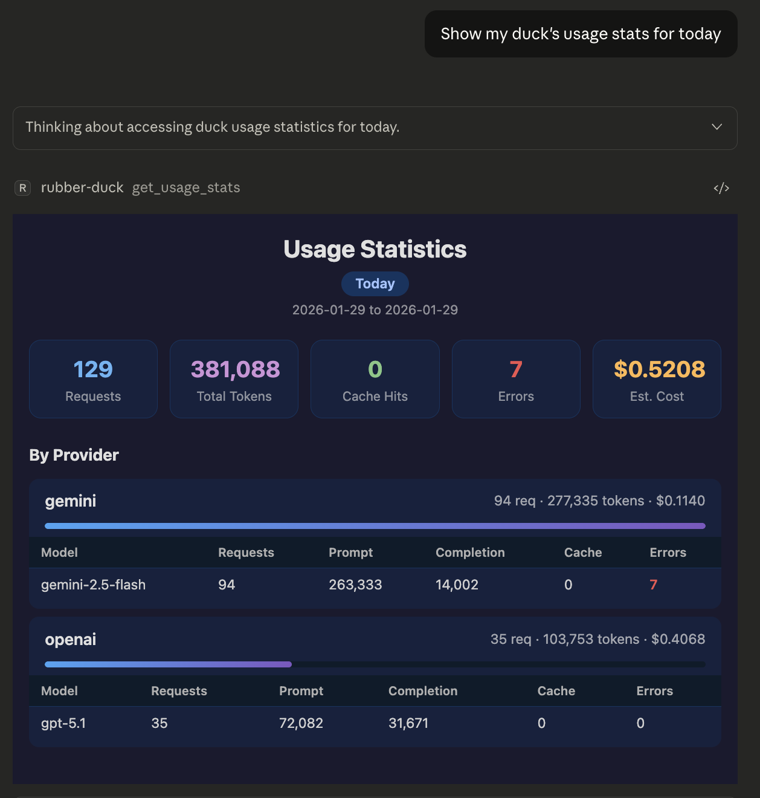

# 🦆 MCP Rubber Duck

An MCP (Model Context Protocol) server that acts as a bridge to query multiple LLMs — both OpenAI-compatible HTTP APIs and CLI coding agents. Just like rubber duck debugging, explain your problems to various AI "ducks" and get different perspectives!

[](https://www.npmjs.com/package/mcp-rubber-duck)
[](https://github.com/nesquikm/mcp-rubber-duck/pkgs/container/mcp-rubber-duck)
[](https://registry.modelcontextprotocol.io)

<p align="center">
  
</p>

## Table of Contents

- [Features](#features)
- [Supported Providers](#supported-providers)
- [Quick Start](#quick-start)
- [Installation](#installation)
- [Configuration](#configuration)
- [Claude Desktop Configuration](#claude-desktop-configuration)
- [MCP Bridge](#mcp-bridge---connect-to-other-mcp-servers)
- [Guardrails](#guardrails---safety--compliance-layer)
- [Interactive UIs (MCP Apps)](#interactive-uis-mcp-apps)
- [Available Tools](#available-tools)
  - [Basic Tools](#basic-tools)
  - [Multi-Agent Tools](#multi-agent-consensus--debate-tools)
  - [MCP Bridge Tools](#mcp-bridge-tools)
- [Available Prompts](#available-prompts)
  - [Known Limitations (Claude Code)](#known-limitations-claude-code)
  - [Recommended: Use Prompts as Templates](#recommended-use-prompts-as-templates)
- [Usage Examples](#usage-examples)
- [CLI Providers](#cli-providers---coding-agents-as-ducks)
- [Provider-Specific Setup](#provider-specific-setup)
- [Development](#development)
- [Docker Support](#docker-support)
- [Troubleshooting](#troubleshooting)
- [Contributing](#contributing)

## Features

- 🔌 **Universal OpenAI Compatibility**: Works with any OpenAI-compatible API endpoint
- 🖥️ **CLI Agent Support**: Use CLI coding agents (Claude Code, Codex, Gemini CLI, Grok, Aider) as ducks
- 🦆 **Multiple Ducks**: Configure and query multiple LLM providers simultaneously
- 💬 **Conversation Management**: Maintain context across multiple messages
- 🏛️ **Duck Council**: Get responses from all your configured LLMs at once
- 🗳️ **Consensus Voting**: Multi-duck voting with reasoning and confidence scores
- ⚖️ **LLM-as-Judge**: Have ducks evaluate and rank each other's responses
- 🔄 **Iterative Refinement**: Two ducks collaboratively improve responses
- 🎓 **Structured Debates**: Oxford, Socratic, and adversarial debate formats
- 📝 **MCP Prompts**: 8 reusable prompt templates for multi-LLM workflows (via `/` commands)
- 💾 **Response Caching**: Avoid duplicate API calls with intelligent caching
- 🔁 **Automatic Failover**: Falls back to other providers if primary fails
- 📊 **Health Monitoring**: Real-time health checks for all providers
- 💰 **Usage Tracking**: Track requests, tokens, and estimated costs per provider
- 🔗 **MCP Bridge**: Connect ducks to other MCP servers for extended functionality
- 🛡️ **Guardrails**: Pluggable safety layer with rate limiting, token limits, pattern blocking, and PII redaction
- 🔐 **Granular Security**: Per-server approval controls with session-based approvals
- 🖼️ **Interactive UIs**: Rich HTML panels for compare, vote, debate, and usage tools (via [MCP Apps](https://github.com/modelcontextprotocol/ext-apps))
- 🏷️ **Tool Annotations**: MCP-compliant hints for tool behavior (read-only, destructive, etc.)
- 🎨 **Fun Duck Theme**: Rubber duck debugging with personality!

## Supported Providers

### HTTP Providers (OpenAI-compatible API)

Any provider with an OpenAI-compatible API endpoint, including:

- **OpenAI** (GPT-5.1, o3, o4-mini)
- **Google Gemini** (Gemini 3, Gemini 2.5 Pro/Flash)
- **Anthropic** (via OpenAI-compatible endpoints)
- **Groq** (Llama 4, Llama 3.3)
- **Together AI** (Llama 4, Qwen, and more)
- **Perplexity** (Online models with web search)
- **Anyscale** (Open source models)
- **Azure OpenAI** (Microsoft-hosted OpenAI)
- **Ollama** (Local models)
- **LM Studio** (Local models)
- **Custom** (Any OpenAI-compatible endpoint)

### CLI Providers (Coding Agents)

Command-line coding agents that run as local processes:

- **Claude Code** (`claude`) — Anthropic's CLI agent
- **Codex** (`codex`) — OpenAI's CLI agent
- **Gemini CLI** (`gemini`) — Google's CLI agent
- **Grok CLI** (`grok`) — xAI's CLI agent
- **Aider** (`aider`) — Open-source AI pair programmer
- **Custom** — Any CLI tool that accepts prompts and returns text

## Quick Start

```bash
# Install globally
npm install -g mcp-rubber-duck

# Or use npx directly in Claude Desktop config
npx mcp-rubber-duck
```

**Using Claude Desktop?** Jump to [Claude Desktop Configuration](#claude-desktop-configuration).

## Installation

### Prerequisites

- Node.js 20 or higher
- npm or yarn
- At least one API key for an HTTP provider, **or** a CLI coding agent installed locally

### Installation Methods

#### Option 1: Install from NPM

```bash
npm install -g mcp-rubber-duck
```

#### Option 2: Install from Source

```bash
# Clone the repository
git clone https://github.com/nesquikm/mcp-rubber-duck.git
cd mcp-rubber-duck

# Install dependencies
npm install

# Build the project
npm run build

# Run the server
npm start
```

## Configuration

### Method 1: Environment Variables

Create a `.env` file in the project root:

```env
# OpenAI
OPENAI_API_KEY=sk-...
OPENAI_DEFAULT_MODEL=gpt-5.1  # Optional: defaults to gpt-5.1

# Google Gemini
GEMINI_API_KEY=...
GEMINI_DEFAULT_MODEL=gemini-2.5-flash  # Optional: defaults to gemini-2.5-flash

# Groq
GROQ_API_KEY=gsk_...
GROQ_DEFAULT_MODEL=llama-3.3-70b-versatile  # Optional: defaults to llama-3.3-70b-versatile

# Ollama (Local)
OLLAMA_BASE_URL=http://localhost:11434/v1  # Optional
OLLAMA_DEFAULT_MODEL=llama3.2  # Optional: defaults to llama3.2

# Custom Providers (you can add multiple)
# Format: CUSTOM_{NAME}_* where NAME becomes the provider key (lowercase)

# Example: Add provider "myapi"
CUSTOM_MYAPI_API_KEY=...
CUSTOM_MYAPI_BASE_URL=https://api.example.com/v1
CUSTOM_MYAPI_DEFAULT_MODEL=custom-model  # Optional
CUSTOM_MYAPI_MODELS=model1,model2        # Optional: comma-separated list
CUSTOM_MYAPI_NICKNAME=My Custom Duck     # Optional: display name

# Example: Add provider "azure"
CUSTOM_AZURE_API_KEY=...
CUSTOM_AZURE_BASE_URL=https://mycompany.openai.azure.com/v1

# CLI Providers (coding agents as ducks)
# Enable preset CLI agents
CLI_CLAUDE_ENABLED=true                      # Claude Code CLI
CLI_CODEX_ENABLED=true                       # OpenAI Codex CLI
CLI_GEMINI_ENABLED=true                      # Gemini CLI
CLI_GROK_ENABLED=true                        # Grok CLI
CLI_AIDER_ENABLED=true                       # Aider

# Optional overrides for preset CLI agents
CLI_CLAUDE_NICKNAME=My Claude                # Optional: display name
CLI_CLAUDE_DEFAULT_MODEL=claude-sonnet-4-20250514  # Optional: model override
CLI_CLAUDE_SYSTEM_PROMPT=Be concise          # Optional: system prompt
CLI_CLAUDE_CLI_ARGS=--max-turns,5,--verbose  # Optional: extra CLI args

# Custom CLI providers (any CLI tool)
CLI_CUSTOM_MYTOOL_COMMAND=/usr/local/bin/mytool
CLI_CUSTOM_MYTOOL_NICKNAME=My Tool
CLI_CUSTOM_MYTOOL_PROMPT_DELIVERY=stdin      # flag, positional, or stdin
CLI_CUSTOM_MYTOOL_OUTPUT_FORMAT=text         # text, json, or jsonl
CLI_CUSTOM_MYTOOL_PROCESS_TIMEOUT=60000      # Optional: ms (default: 120000)
CLI_CUSTOM_MYTOOL_WORKING_DIRECTORY=/tmp     # Optional: working directory

# Global Settings
DEFAULT_PROVIDER=openai
DEFAULT_TEMPERATURE=0.7
LOG_LEVEL=info

# MCP Bridge Settings (Optional)
MCP_BRIDGE_ENABLED=true                      # Enable ducks to access external MCP servers
MCP_APPROVAL_MODE=trusted                    # always, trusted, or never
MCP_APPROVAL_TIMEOUT=300                     # seconds

# MCP Server: Context7 Documentation (Example)
MCP_SERVER_CONTEXT7_TYPE=http
MCP_SERVER_CONTEXT7_URL=https://mcp.context7.com/mcp
MCP_SERVER_CONTEXT7_ENABLED=true

# Per-server trusted tools
MCP_TRUSTED_TOOLS_CONTEXT7=*                 # Trust all Context7 tools

# Optional: Custom Duck Nicknames (Have fun with these!)
OPENAI_NICKNAME="DUCK-4"              # Optional: defaults to "GPT Duck"
GEMINI_NICKNAME="Duckmini"            # Optional: defaults to "Gemini Duck"
GROQ_NICKNAME="Quackers"              # Optional: defaults to "Groq Duck"
OLLAMA_NICKNAME="Local Quacker"       # Optional: defaults to "Local Duck"
# For custom providers, use: CUSTOM_{NAME}_NICKNAME (see custom provider section above)
```

**Note:** Duck nicknames are completely optional! If you don't set them, you'll get the charming defaults (GPT Duck, Gemini Duck, etc.). If you use a `config.json` file, those nicknames take priority over environment variables.

### Method 2: Configuration File

Create a `config/config.json` file based on the example:

```bash
cp config/config.example.json config/config.json
# Edit config/config.json with your API keys and preferences
```

## Claude Desktop Configuration

This is the most common setup method for using MCP Rubber Duck with Claude Desktop.

### Step 1: Install

Choose one of these options:

**Option A: NPM (Recommended)**
```bash
npm install -g mcp-rubber-duck
```

**Option B: From Source** (see [Installation from Source](#option-2-install-from-source))

### Step 2: Configure Claude Desktop

Edit your Claude Desktop config file:

- **macOS**: `~/Library/Application Support/Claude/claude_desktop_config.json`
- **Windows**: `%APPDATA%\Claude\claude_desktop_config.json`

Add the MCP server configuration:

**If installed via NPM:**
```json
{
  "mcpServers": {
    "rubber-duck": {
      "command": "mcp-rubber-duck",
      "env": {
        "MCP_SERVER": "true",
        "OPENAI_API_KEY": "your-openai-api-key-here",
        "GEMINI_API_KEY": "your-gemini-api-key-here",
        "DEFAULT_PROVIDER": "openai"
      }
    }
  }
}
```

**If installed from source:**
```json
{
  "mcpServers": {
    "rubber-duck": {
      "command": "node",
      "args": ["/absolute/path/to/mcp-rubber-duck/dist/index.js"],
      "env": {
        "MCP_SERVER": "true",
        "OPENAI_API_KEY": "your-openai-api-key-here",
        "GEMINI_API_KEY": "your-gemini-api-key-here",
        "DEFAULT_PROVIDER": "openai"
      }
    }
  }
}
```

**Important**: Replace the placeholder API keys with your actual keys:
- `your-openai-api-key-here` → Your OpenAI API key (starts with `sk-`)
- `your-gemini-api-key-here` → Your Gemini API key from [Google AI Studio](https://aistudio.google.com/apikey)

**Note**: `MCP_SERVER: "true"` is required - this tells rubber-duck to run as an MCP server for any MCP client (not related to the MCP Bridge feature).

**Tip**: See [Configuration](#configuration) for additional options like `LOG_LEVEL`, custom model defaults, and duck nicknames.

### Step 3: Restart Claude Desktop

1. Completely quit Claude Desktop (⌘+Q on Mac)
2. Launch Claude Desktop again
3. The MCP server should connect automatically

### Step 4: Test the Integration

Once restarted, test these commands in Claude:

#### Check Duck Health
```
Use the list_ducks tool with check_health: true
```
Should show:
- ✅ **GPT Duck** (openai) - Healthy
- ✅ **Gemini Duck** (gemini) - Healthy

#### List Available Models
```
Use the list_models tool
```

#### Ask a Specific Duck
```
Use the ask_duck tool with prompt: "What is rubber duck debugging?", provider: "openai"
```

#### Compare Multiple Ducks
```
Use the compare_ducks tool with prompt: "Explain async/await in JavaScript"
```

#### Test Specific Models
```
Use the ask_duck tool with prompt: "Hello", provider: "openai", model: "gpt-4o"
```

### Troubleshooting Claude Desktop Setup

#### If Tools Don't Appear
1. **Check API Keys**: Ensure your API keys are correctly entered without typos
2. **Verify Build**: Run `ls -la dist/index.js` to confirm the project built successfully  
3. **Check Logs**: Look for errors in Claude Desktop's developer console
4. **Restart**: Fully quit and restart Claude Desktop after config changes

#### Connection Issues
1. **Config File Path**: Double-check you're editing the correct config file path
2. **JSON Syntax**: Validate your JSON syntax (no trailing commas, proper quotes)
3. **Absolute Paths**: Ensure you're using the full absolute path to `dist/index.js`
4. **File Permissions**: Verify Claude Desktop can read the dist directory

#### Health Check Failures
If ducks show as unhealthy:
1. **API Keys**: Verify keys are valid and have sufficient credits/quota
2. **Network**: Check internet connection and firewall settings
3. **Rate Limits**: Some providers have strict rate limits for new accounts

## MCP Bridge - Connect to Other MCP Servers

The MCP Bridge allows your ducks to access tools from other MCP servers, extending their capabilities beyond just chat. Your ducks can now search documentation, access files, query APIs, and much more!

**Note**: This is different from the MCP server integration above:
- **MCP Bridge** (`MCP_BRIDGE_ENABLED`): Ducks USE external MCP servers as clients
- **MCP Server** (`MCP_SERVER`): Rubber-duck SERVES as an MCP server to any MCP client

### Quick Setup

Add these environment variables to enable MCP Bridge:

```bash
# Basic MCP Bridge Configuration
MCP_BRIDGE_ENABLED="true"                # Enable ducks to access external MCP servers
MCP_APPROVAL_MODE="trusted"              # always, trusted, or never
MCP_APPROVAL_TIMEOUT="300"               # 5 minutes

# Example: Context7 Documentation Server
MCP_SERVER_CONTEXT7_TYPE="http"
MCP_SERVER_CONTEXT7_URL="https://mcp.context7.com/mcp"
MCP_SERVER_CONTEXT7_ENABLED="true"

# Trust all Context7 tools (no approval needed)
MCP_TRUSTED_TOOLS_CONTEXT7="*"
```

### Approval Modes

**`always`**: Every tool call requires approval (with session-based memory)
- First use of a tool → requires approval
- Subsequent uses of the same tool → automatic (until restart)

**`trusted`**: Only untrusted tools require approval
- Tools in trusted lists execute immediately
- Unknown tools require approval

**`never`**: All tools execute immediately (use with caution)

### Per-Server Trusted Tools

Configure trust levels per MCP server for granular security:

```bash
# Trust all tools from Context7 (documentation server)
MCP_TRUSTED_TOOLS_CONTEXT7="*"

# Trust specific filesystem operations only
MCP_TRUSTED_TOOLS_FILESYSTEM="read-file,list-directory"

# Trust specific GitHub tools
MCP_TRUSTED_TOOLS_GITHUB="get-repo-info,list-issues"

# Global fallback for servers without specific config
MCP_TRUSTED_TOOLS="common-safe-tool"
```

### MCP Server Configuration

Configure MCP servers using environment variables:

#### HTTP Servers
```bash
MCP_SERVER_{NAME}_TYPE="http"
MCP_SERVER_{NAME}_URL="https://api.example.com/mcp"
MCP_SERVER_{NAME}_API_KEY="your-api-key"        # Optional
MCP_SERVER_{NAME}_ENABLED="true"
```

#### STDIO Servers  
```bash
MCP_SERVER_{NAME}_TYPE="stdio"
MCP_SERVER_{NAME}_COMMAND="python"
MCP_SERVER_{NAME}_ARGS="/path/to/script.py,--arg1,--arg2"
MCP_SERVER_{NAME}_ENABLED="true"
```

### Example: Enable Context7 Documentation

```bash
# Enable MCP Bridge
MCP_BRIDGE_ENABLED="true"
MCP_APPROVAL_MODE="trusted"

# Configure Context7 server
MCP_SERVER_CONTEXT7_TYPE="http"
MCP_SERVER_CONTEXT7_URL="https://mcp.context7.com/mcp"
MCP_SERVER_CONTEXT7_ENABLED="true"

# Trust all Context7 tools
MCP_TRUSTED_TOOLS_CONTEXT7="*"
```

Now your ducks can search and retrieve documentation from Context7:

```
Ask: "Can you find React hooks documentation from Context7 and return only the key concepts?"
Duck: *searches Context7 and returns focused, essential React hooks information*
```

### Token Optimization Benefits

**Smart Token Management**: Ducks can retrieve comprehensive data from MCP servers but return only the essential information you need, saving tokens in your host LLM conversations:

- **Ask for specifics**: "Find TypeScript interfaces documentation and return only the core concepts"
- **Duck processes full docs**: Accesses complete documentation from Context7
- **Returns condensed results**: Provides focused, relevant information while filtering out unnecessary details
- **Token savings**: Reduces response size by 70-90% compared to raw documentation dumps

**Example Workflow:**
```
You: "Find Express.js routing concepts from Context7, keep it concise"
Duck: *Retrieves full Express docs, processes, and returns only routing essentials*
Result: 500 tokens instead of 5,000+ tokens of raw documentation
```

### Session-Based Approvals

When using `always` mode, the system remembers your approvals:

1. **First time**: "Duck wants to use `search-docs` - Approve? ✅"
2. **Next time**: Duck uses `search-docs` automatically (no new approval needed)
3. **Different tool**: "Duck wants to use `get-examples` - Approve? ✅"  
4. **Restart**: Session memory clears, start over

This eliminates approval fatigue while maintaining security!

## Guardrails - Safety & Compliance Layer

Guardrails provide a pluggable safety and compliance layer that intercepts LLM requests and responses. Protect against rate abuse, limit token usage, block sensitive patterns, and automatically redact PII.

### Quick Setup

```bash
# Enable guardrails with PII protection
GUARDRAILS_ENABLED="true"
GUARDRAILS_PII_REDACTOR_ENABLED="true"
GUARDRAILS_PII_REDACTOR_ALLOWLIST_DOMAINS="mycompany.com"
```

### Global Settings

| Variable | Type | Default | Description |
|----------|------|---------|-------------|
| `GUARDRAILS_ENABLED` | boolean | `false` | Master switch for guardrails system |
| `GUARDRAILS_LOG_VIOLATIONS` | boolean | `true` | Log when guardrails detect violations |
| `GUARDRAILS_LOG_MODIFICATIONS` | boolean | `false` | Log when guardrails modify content |
| `GUARDRAILS_FAIL_OPEN` | boolean | `false` | If `true`, allow requests when guardrails error; if `false`, block on error |

### Rate Limiter

Prevent API abuse by limiting request frequency.

```bash
GUARDRAILS_RATE_LIMITER_ENABLED="true"
GUARDRAILS_RATE_LIMITER_REQUESTS_PER_MINUTE="60"
GUARDRAILS_RATE_LIMITER_REQUESTS_PER_HOUR="500"
GUARDRAILS_RATE_LIMITER_PER_PROVIDER="true"      # Track limits per provider
GUARDRAILS_RATE_LIMITER_BURST_ALLOWANCE="5"      # Extra requests for short bursts
```

| Variable | Type | Default | Description |
|----------|------|---------|-------------|
| `GUARDRAILS_RATE_LIMITER_ENABLED` | boolean | `false` | Enable rate limiting |
| `GUARDRAILS_RATE_LIMITER_REQUESTS_PER_MINUTE` | number | `60` | Max requests per minute |
| `GUARDRAILS_RATE_LIMITER_REQUESTS_PER_HOUR` | number | `1000` | Max requests per hour |
| `GUARDRAILS_RATE_LIMITER_PER_PROVIDER` | boolean | `false` | Track limits per provider vs global |
| `GUARDRAILS_RATE_LIMITER_BURST_ALLOWANCE` | number | `5` | Extra requests allowed for bursts |

### Token Limiter

Control token usage for cost management.

```bash
GUARDRAILS_TOKEN_LIMITER_ENABLED="true"
GUARDRAILS_TOKEN_LIMITER_MAX_INPUT_TOKENS="100000"
GUARDRAILS_TOKEN_LIMITER_MAX_OUTPUT_TOKENS="16000"
GUARDRAILS_TOKEN_LIMITER_WARN_AT_PERCENTAGE="80"
```

| Variable | Type | Default | Description |
|----------|------|---------|-------------|
| `GUARDRAILS_TOKEN_LIMITER_ENABLED` | boolean | `false` | Enable token limiting |
| `GUARDRAILS_TOKEN_LIMITER_MAX_INPUT_TOKENS` | number | `8192` | Max tokens in input prompt |
| `GUARDRAILS_TOKEN_LIMITER_MAX_OUTPUT_TOKENS` | number | - | Max tokens in response |
| `GUARDRAILS_TOKEN_LIMITER_WARN_AT_PERCENTAGE` | number | `80` | Warn when usage hits this % |

### Pattern Blocker

Block or redact sensitive patterns in requests.

```bash
GUARDRAILS_PATTERN_BLOCKER_ENABLED="true"
GUARDRAILS_PATTERN_BLOCKER_PATTERNS="confidential,internal-only"
GUARDRAILS_PATTERN_BLOCKER_PATTERNS_REGEX="secret-\\d{4}"
GUARDRAILS_PATTERN_BLOCKER_CASE_SENSITIVE="false"
GUARDRAILS_PATTERN_BLOCKER_ACTION="block"        # block, warn, or redact
```

| Variable | Type | Default | Description |
|----------|------|---------|-------------|
| `GUARDRAILS_PATTERN_BLOCKER_ENABLED` | boolean | `false` | Enable pattern blocking |
| `GUARDRAILS_PATTERN_BLOCKER_PATTERNS` | string | - | Comma-separated literal patterns |
| `GUARDRAILS_PATTERN_BLOCKER_PATTERNS_REGEX` | string | - | Comma-separated regex patterns |
| `GUARDRAILS_PATTERN_BLOCKER_CASE_SENSITIVE` | boolean | `false` | Case-sensitive matching |
| `GUARDRAILS_PATTERN_BLOCKER_ACTION` | string | `block` | Action: `block`, `warn`, or `redact` |

### PII Redactor

Automatically detect and redact personally identifiable information.

```bash
GUARDRAILS_PII_REDACTOR_ENABLED="true"
GUARDRAILS_PII_REDACTOR_DETECT_EMAILS="true"
GUARDRAILS_PII_REDACTOR_DETECT_PHONES="true"
GUARDRAILS_PII_REDACTOR_DETECT_SSN="true"
GUARDRAILS_PII_REDACTOR_DETECT_API_KEYS="true"
GUARDRAILS_PII_REDACTOR_DETECT_CREDIT_CARDS="true"
GUARDRAILS_PII_REDACTOR_DETECT_IP_ADDRESSES="true"
GUARDRAILS_PII_REDACTOR_ALLOWLIST_DOMAINS="gmail.com,company.com"
GUARDRAILS_PII_REDACTOR_RESTORE_ON_RESPONSE="true"
```

| Variable | Type | Default | Description |
|----------|------|---------|-------------|
| `GUARDRAILS_PII_REDACTOR_ENABLED` | boolean | `false` | Enable PII detection/redaction |
| `GUARDRAILS_PII_REDACTOR_DETECT_EMAILS` | boolean | `true` | Detect email addresses |
| `GUARDRAILS_PII_REDACTOR_DETECT_PHONES` | boolean | `true` | Detect phone numbers |
| `GUARDRAILS_PII_REDACTOR_DETECT_SSN` | boolean | `true` | Detect US Social Security Numbers |
| `GUARDRAILS_PII_REDACTOR_DETECT_API_KEYS` | boolean | `true` | Detect API keys (sk-*, gsk_*, etc.) |
| `GUARDRAILS_PII_REDACTOR_DETECT_CREDIT_CARDS` | boolean | `true` | Detect credit card numbers |
| `GUARDRAILS_PII_REDACTOR_DETECT_IP_ADDRESSES` | boolean | `false` | Detect IPv4 addresses |
| `GUARDRAILS_PII_REDACTOR_ALLOWLIST` | string | - | Comma-separated exact values to skip |
| `GUARDRAILS_PII_REDACTOR_ALLOWLIST_DOMAINS` | string | - | Comma-separated email domains to skip |
| `GUARDRAILS_PII_REDACTOR_RESTORE_ON_RESPONSE` | boolean | `false` | Restore original PII in responses |
| `GUARDRAILS_PII_REDACTOR_LOG_DETECTIONS` | boolean | `true` | Log when PII is detected |

**How PII Redaction Works:**
1. User sends: `"Contact john@secret.com for details"`
2. Pre-request: Redacted to `"Contact [EMAIL_1] for details"`
3. LLM processes the redacted text
4. Post-response: If `restore_on_response=true`, `[EMAIL_1]` → `john@secret.com`

### Example: Full Production Config

```bash
# Enable guardrails
GUARDRAILS_ENABLED="true"
GUARDRAILS_LOG_VIOLATIONS="true"

# Rate limiting
GUARDRAILS_RATE_LIMITER_ENABLED="true"
GUARDRAILS_RATE_LIMITER_REQUESTS_PER_MINUTE="60"
GUARDRAILS_RATE_LIMITER_REQUESTS_PER_HOUR="500"

# Token limits
GUARDRAILS_TOKEN_LIMITER_ENABLED="true"
GUARDRAILS_TOKEN_LIMITER_MAX_INPUT_TOKENS="100000"
GUARDRAILS_TOKEN_LIMITER_MAX_OUTPUT_TOKENS="16000"

# Block sensitive patterns
GUARDRAILS_PATTERN_BLOCKER_ENABLED="true"
GUARDRAILS_PATTERN_BLOCKER_PATTERNS="confidential,internal-only"
GUARDRAILS_PATTERN_BLOCKER_ACTION="warn"

# PII protection
GUARDRAILS_PII_REDACTOR_ENABLED="true"
GUARDRAILS_PII_REDACTOR_ALLOWLIST_DOMAINS="gmail.com,company.com"
GUARDRAILS_PII_REDACTOR_RESTORE_ON_RESPONSE="true"
```

### Guardrail Phases

Guardrails intercept at multiple points in the request lifecycle:

| Phase | Description | Plugins |
|-------|-------------|---------|
| `pre_request` | Before sending to LLM | Rate limiter, Token limiter, Pattern blocker, PII redactor |
| `post_response` | After receiving from LLM | Token limiter, PII redactor (restore) |
| `pre_tool_input` | Before MCP tool execution | PII redactor |
| `post_tool_output` | After MCP tool returns | PII redactor (restore) |

## Interactive UIs (MCP Apps)

Four tools — `compare_ducks`, `duck_vote`, `duck_debate`, and `get_usage_stats` — can render rich interactive HTML panels inside supported MCP clients via [MCP Apps](https://github.com/modelcontextprotocol/ext-apps). Once this MCP server is configured in a supporting client, the UIs appear automatically — no additional setup is required. Clients without MCP Apps support still receive the same plain text output (no functionality is lost). See the [MCP Apps repo](https://github.com/modelcontextprotocol/ext-apps) for an up-to-date list of supported clients.

### Compare Ducks

Compare multiple model responses side-by-side, with latency indicators, token counts, model badges, and error states.

<p align="center">
  
</p>

### Duck Vote

Have multiple ducks vote on options, displayed as a visual vote tally with bar charts, consensus badge, winner card, confidence bars, and collapsible reasoning.

<p align="center">
  
</p>

### Duck Debate

Structured multi-round debate between ducks, shown as a round-by-round view with format badge, participant list, collapsible rounds, and synthesis section.

<p align="center">
  
</p>

### Usage Stats

Usage analytics with summary cards, provider breakdown with expandable rows, token distribution bars, and estimated costs.

<p align="center">
  
</p>

## Available Tools

### Basic Tools

#### 🦆 ask_duck
Ask a single question to a specific LLM provider. When MCP Bridge is enabled, ducks can automatically access tools from connected MCP servers.

```typescript
{
  "prompt": "What is rubber duck debugging?",
  "provider": "openai",  // Optional, uses default if not specified
  "temperature": 0.7     // Optional
}
```

#### 💬 chat_with_duck
Have a conversation with context maintained across messages.

```typescript
{
  "conversation_id": "debug-session-1",
  "message": "Can you help me debug this code?",
  "provider": "groq"  // Optional, can switch providers mid-conversation
}
```

#### 🧹 clear_conversations
Clear all conversation history and start fresh. Useful when switching topics or when context becomes too large.

```typescript
{
  // No parameters required
}
```

#### 📋 list_ducks
List all configured providers and their health status.

```typescript
{
  "check_health": true  // Optional, performs fresh health check
}
```

#### 📊 list_models
List available models for LLM providers.

```typescript
{
  "provider": "openai",     // Optional, lists all if not specified
  "fetch_latest": false     // Optional, fetch latest from API vs cached
}
```

#### 🔍 compare_ducks
Ask the same question to multiple providers simultaneously. Renders an [interactive UI](#compare-ducks) in supported clients.

```typescript
{
  "prompt": "What's the best programming language?",
  "providers": ["openai", "groq", "ollama"]  // Optional, uses all if not specified
}
```

#### 🏛️ duck_council
Get responses from all configured ducks - like a panel discussion!

```typescript
{
  "prompt": "How should I architect a microservices application?"
}
```

#### 📊 get_usage_stats
Get usage statistics and estimated costs for your duck queries. Renders an [interactive UI](#usage-stats) in supported clients.

```typescript
{
  "period": "today"  // Optional: "today", "7d", "30d", or "all"
}
```

Returns requests, tokens (prompt/completion), cache hits, errors, and estimated costs broken down by provider and model.

Usage data is stored in `~/.mcp-rubber-duck/data/usage.json`.

### Multi-Agent Consensus & Debate Tools

Research-backed tools for multi-agent coordination.

#### 🗳️ duck_vote
Have multiple ducks vote on options with reasoning and confidence scores. Renders an [interactive UI](#duck-vote) in supported clients.

```typescript
{
  "question": "Best approach for error handling?",
  "options": ["try-catch", "Result type", "Either monad"],
  "voters": ["openai", "gemini"],     // Optional, uses all if not specified
  "require_reasoning": true            // Optional, default: true
}
```

Returns vote tally, confidence scores, and consensus level (unanimous, majority, plurality, split, none).

#### ⚖️ duck_judge
Have one duck evaluate and rank other ducks' responses. Use after `duck_council`.

```typescript
{
  "responses": [/* responses from duck_council */],
  "judge": "openai",                   // Optional, uses first available
  "criteria": ["accuracy", "completeness", "clarity"],  // Optional
  "persona": "senior engineer"         // Optional, e.g., "security expert"
}
```

#### 🔄 duck_iterate
Iteratively refine a response between two ducks.

```typescript
{
  "prompt": "Write a function to validate email addresses",
  "providers": ["openai", "gemini"],   // Exactly 2 providers
  "mode": "critique-improve",          // or "refine"
  "iterations": 3                      // Optional, default: 3, max: 10
}
```

Modes:
- **refine**: Each duck improves the previous response
- **critique-improve**: Alternates between critiquing and improving

#### 🎓 duck_debate
Structured multi-round debate between ducks. Renders an [interactive UI](#duck-debate) in supported clients.

```typescript
{
  "prompt": "Should startups use microservices or monolith for MVP?",
  "format": "oxford",                  // "oxford", "socratic", or "adversarial"
  "rounds": 2,                         // Optional, default: 3
  "providers": ["openai", "gemini"],   // Optional, uses all if not specified
  "synthesizer": "openai"              // Optional, duck to synthesize debate
}
```

Formats:
- **oxford**: Structured pro/con arguments
- **socratic**: Question-based philosophical exploration
- **adversarial**: One defends, others attack weaknesses

### MCP Bridge Tools

Tools for managing MCP server connections and tool approvals.

#### 🔗 mcp_status
Get status of MCP Bridge, connected servers, and pending approvals.

```typescript
{
  // No parameters required
}
```

#### ✅ get_pending_approvals
Get list of pending MCP tool approvals from ducks.

```typescript
{
  "duck": "openai"  // Optional, filter by duck name
}
```

#### 🛡️ approve_mcp_request
Approve or deny a duck's MCP tool request.

```typescript
{
  "approval_id": "abc123",       // Required
  "decision": "approve",         // "approve" or "deny"
  "reason": "Not needed"         // Optional, reason for denial
}
```

## Available Prompts

MCP Prompts are reusable templates that help you structure questions for multi-LLM analysis. Access them via `/` commands in Claude Desktop or other MCP clients.

**Key Concept**: Unlike tools (which execute actions), prompts help you *frame your questions* to get better multi-perspective responses from multiple LLMs.

| Prompt | Purpose | Required Arguments |
|--------|---------|-------------------|
| 📊 `perspectives` | Multi-angle analysis with assigned lenses | `problem`, `perspectives` |
| 🔍 `assumptions` | Surface hidden assumptions in plans | `plan` |
| 👁️ `blindspots` | Hunt for overlooked risks and gaps | `proposal` |
| ⚖️ `tradeoffs` | Structured option comparison | `options`, `criteria` |
| 🛡️ `red_team` | Security/risk analysis from multiple angles | `target` |
| 🔄 `reframe` | Problem reframing at different levels | `problem` |
| 🏗️ `architecture` | Design review across concerns | `design`, `workloads`, `priorities` |
| 💡 `diverge_converge` | Divergent exploration then convergence | `challenge` |

### Example: Using `perspectives` with Duck Council

The most reliable way to use prompts is as templates with duck tools:

```
Use duck_council with this prompt:

"Analyze this problem from multiple perspectives:

**PROBLEM:** Review this authentication middleware for our API

**PERSPECTIVES:** security, performance, maintainability, error handling

**CONTEXT:** [paste your code here]

Each LLM should adopt ONE lens and provide targeted analysis from that viewpoint."
```

### Example: Using `tradeoffs` with Compare Ducks

```
Use compare_ducks with this prompt:

"Analyze these technical options:

**OPTIONS:** PostgreSQL, MongoDB, Redis

**CRITERIA:** scalability, query flexibility, operational complexity, cost

**CONTEXT:** Real-time analytics dashboard with 10k concurrent users

Score each option against each criterion (1-5) and identify the biggest trade-off."
```

This approach works reliably and leverages multi-LLM analysis.

### Known Limitations (Claude Code)

MCP prompts are correctly implemented per the [MCP specification](https://modelcontextprotocol.io/specification/2025-06-18/server/prompts), but Claude Code's support for MCP prompts has limitations:

| Issue | Status | Workaround |
|-------|--------|------------|
| Must type `(MCP)` suffix | Required | Use `/rubber-duck:reframe (MCP)` not `/rubber-duck:reframe` |
| Arguments with spaces broken | [Won't fix](https://github.com/anthropics/claude-code/issues/6657) | Use single words: `problem="checkout-abandonment"` |
| Argument hints not shown | Missing | See table above for required arguments |
| Optional-only prompts need input | [Won't fix](https://github.com/anthropics/claude-code/issues/5597) | Type at least one character |

**Example that works:**
```
/rubber-duck:reframe (MCP) problem="slow-api-responses"
```

**Example that fails:**
```
/rubber-duck:reframe (MCP) problem="Users abandon checkout at payment"
                                    ↑ spaces break argument parsing
```

### Recommended: Use Prompts as Templates

For the best experience, use prompts as templates with duck tools directly. Copy the prompt structure and send to `duck_council`, `compare_ducks`, or `ask_duck`:

```
Use duck_council with this prompt:

"Analyze this problem from multiple perspectives:

**PROBLEM:** Users abandon checkout at payment step

**PERSPECTIVES:** security, UX, performance, reliability

Each LLM should adopt ONE lens and provide targeted analysis."
```

This approach:
- ✅ Works reliably with full argument text
- ✅ Leverages multi-LLM tools (council, compare, vote)
- ✅ No Claude Code parsing issues

## Usage Examples

### Basic Query
```javascript
// Ask the default duck
await ask_duck({ 
  prompt: "Explain async/await in JavaScript" 
});
```

### Conversation
```javascript
// Start a conversation
await chat_with_duck({
  conversation_id: "learning-session",
  message: "What is TypeScript?"
});

// Continue the conversation
await chat_with_duck({
  conversation_id: "learning-session", 
  message: "How does it differ from JavaScript?"
});
```

### Compare Responses
```javascript
// Get different perspectives
await compare_ducks({
  prompt: "What's the best way to handle errors in Node.js?",
  providers: ["openai", "groq", "ollama"]
});
```

### Duck Council
```javascript
// Convene the council for important decisions
await duck_council({
  prompt: "Should I use REST or GraphQL for my API?"
});
```

### Multi-Agent Voting
```javascript
// Have ducks vote on a decision
await duck_vote({
  question: "Best database for a real-time chat app?",
  options: ["PostgreSQL", "MongoDB", "Redis", "Cassandra"]
});
// Returns: Winner with consensus level (unanimous/majority/split)
```

### Judge Responses
```javascript
// First, get responses from council
const responses = await duck_council({
  prompt: "Implement a rate limiter"
});

// Then have a duck judge them
await duck_judge({
  responses: responses,
  criteria: ["correctness", "efficiency", "readability"],
  persona: "senior backend engineer"
});
```

### Iterative Refinement
```javascript
// Two ducks collaborate to improve a solution
await duck_iterate({
  prompt: "Write a TypeScript function to deep clone objects",
  providers: ["openai", "gemini"],
  mode: "critique-improve",
  iterations: 3
});
```

### Structured Debate
```javascript
// Oxford-style debate on architecture
await duck_debate({
  prompt: "Monorepo vs polyrepo for a growing startup",
  format: "oxford",
  rounds: 3
});
```

### Check Usage Stats
```javascript
// See today's usage
await get_usage_stats({ period: "today" });

// See last 7 days with cost breakdown
await get_usage_stats({ period: "7d" });
```

## CLI Providers - Coding Agents as Ducks

Use CLI coding agents as ducks alongside HTTP providers. CLI providers spawn a local process, pipe the prompt, and parse the output — no API key required.

### Preset Agents

Enable known CLI agents with a single env var:

```bash
CLI_CLAUDE_ENABLED=true    # Uses `claude` command with JSON output
CLI_CODEX_ENABLED=true     # Uses `codex exec` with JSONL output
CLI_GEMINI_ENABLED=true    # Uses `gemini` command with JSON output
CLI_GROK_ENABLED=true      # Uses `grok` command with text output
CLI_AIDER_ENABLED=true     # Uses `aider --message` with text output
```

Each preset comes with sensible defaults for command, arguments, prompt delivery, and output parsing. You can override any default:

```bash
CLI_CLAUDE_NICKNAME=My Claude Agent
CLI_CLAUDE_DEFAULT_MODEL=claude-sonnet-4-20250514
CLI_CLAUDE_CLI_ARGS=--max-turns,5,--verbose
CLI_CLAUDE_SYSTEM_PROMPT=Be concise and technical
```

### Custom CLI Providers

Add any CLI tool as a duck. You can configure **multiple custom CLI providers** — each unique `{NAME}` in `CLI_CUSTOM_{NAME}_*` becomes a separate duck:

```bash
# First custom CLI duck: "cli-mytool"
CLI_CUSTOM_MYTOOL_COMMAND=/usr/local/bin/my-llm
CLI_CUSTOM_MYTOOL_NICKNAME=My LLM Tool
CLI_CUSTOM_MYTOOL_PROMPT_DELIVERY=stdin          # flag, positional, or stdin
CLI_CUSTOM_MYTOOL_OUTPUT_FORMAT=text             # text, json, or jsonl
CLI_CUSTOM_MYTOOL_PROMPT_FLAG=-p                 # Required when delivery=flag
CLI_CUSTOM_MYTOOL_DEFAULT_MODEL=my-model         # Optional
CLI_CUSTOM_MYTOOL_CLI_ARGS=--verbose,--no-color  # Optional: comma-separated
CLI_CUSTOM_MYTOOL_PROCESS_TIMEOUT=300000         # Optional: ms (default: 120000)
CLI_CUSTOM_MYTOOL_WORKING_DIRECTORY=/projects    # Optional

# Second custom CLI duck: "cli-localllm"
CLI_CUSTOM_LOCALLLM_COMMAND=ollama
CLI_CUSTOM_LOCALLLM_NICKNAME=Local Ollama CLI
CLI_CUSTOM_LOCALLLM_PROMPT_DELIVERY=positional
CLI_CUSTOM_LOCALLLM_CLI_ARGS=run,llama3.2

# Third custom CLI duck: "cli-myagent"
CLI_CUSTOM_MYAGENT_COMMAND=/home/user/bin/my-agent
CLI_CUSTOM_MYAGENT_NICKNAME=My Custom Agent
CLI_CUSTOM_MYAGENT_PROMPT_DELIVERY=stdin
CLI_CUSTOM_MYAGENT_OUTPUT_FORMAT=json
```

Each custom CLI provider appears as `cli-{name}` (lowercase) in the duck list.

### Prompt Delivery Methods

| Method | Description | Example |
|--------|-------------|---------|
| `flag` | Prompt passed via a CLI flag | `tool -p "prompt"` |
| `positional` | Prompt as a positional argument | `tool "prompt"` |
| `stdin` | Prompt piped via stdin | `echo "prompt" \| tool` |

### Output Formats

| Format | Description | Use Case |
|--------|-------------|----------|
| `text` | Raw text output (trimmed) | Aider, Grok, simple tools |
| `json` | Single JSON object with path extraction | Claude Code, Gemini CLI |
| `jsonl` | Newline-delimited JSON (last result used) | Codex |

For `json` and `jsonl` formats, the response is extracted using a JSONPath-like `response_json_path` (configured in presets or via config file).

### Claude Desktop with CLI Providers

```json
{
  "mcpServers": {
    "rubber-duck": {
      "command": "mcp-rubber-duck",
      "env": {
        "MCP_SERVER": "true",
        "OPENAI_API_KEY": "your-openai-api-key-here",
        "CLI_CLAUDE_ENABLED": "true",
        "CLI_AIDER_ENABLED": "true"
      }
    }
  }
}
```

CLI ducks appear alongside HTTP ducks in `list_ducks` and can be used with all multi-agent tools (`compare_ducks`, `duck_council`, `duck_vote`, etc.).

### Config File (Alternative to Env Vars)

CLI providers can also be configured via `config/config.json`. Set `"type": "cli"` to distinguish from HTTP providers:

```json
{
  "providers": {
    "openai": {
      "api_key": "sk-...",
      "base_url": "https://api.openai.com/v1",
      "models": ["gpt-5.1"],
      "default_model": "gpt-5.1",
      "nickname": "GPT Duck"
    },
    "cli-claude": {
      "type": "cli",
      "cli_type": "claude",
      "nickname": "Claude Agent",
      "system_prompt": "Be concise"
    },
    "cli-custom": {
      "type": "cli",
      "cli_type": "custom",
      "cli_command": "/usr/local/bin/my-llm",
      "prompt_delivery": "stdin",
      "output_format": "text",
      "nickname": "My Tool"
    }
  }
}
```

See `config/config.example.json` for the full example including all preset and custom CLI providers. Existing HTTP-only configs continue to work unchanged (providers without `"type"` default to `"http"`).

### CLI Provider Limitations

CLI coding agents work differently from HTTP providers and have some important limitations:

#### MCP Bridge Not Supported

CLI ducks **cannot use the MCP Bridge feature**. They have their own native tool systems that would conflict with injected MCP tools. Instead, configure MCP servers directly in each CLI tool's native config:

```bash
# Codex - add MCP servers via its CLI
codex mcp add context7 --url https://mcp.context7.com/mcp
codex mcp add chrome -- npx chrome-devtools-mcp@latest

# Gemini CLI - add MCP servers via its CLI
gemini mcp add context7 https://mcp.context7.com/mcp -t http -s user --trust
gemini mcp add chrome "npx chrome-devtools-mcp@latest" -s user --trust
```

#### Non-Interactive Mode Differences

| Feature | Codex | Gemini CLI |
|---------|-------|------------|
| HTTP MCP servers (e.g., context7) | ✅ Works | ✅ Works |
| Stdio MCP servers (e.g., chrome) | ✅ Auto-launches | ❌ Must be pre-running |
| Launch Chrome on demand | ✅ Yes | ❌ No |
| Use already-running Chrome | ✅ Yes | ✅ Yes |

**Workaround for Gemini + Chrome**: Use Codex to launch Chrome first, then Gemini can connect to the already-running instance:

```
1. Ask Codex duck to open Chrome (it auto-launches with debugging)
2. Ask Gemini duck to use Chrome (connects to existing instance)
```

This limitation exists because Gemini CLI only activates MCP servers in interactive mode, not when invoked with the `-p` flag for single prompts.

## Provider-Specific Setup

### Ollama (Local)
```bash
# Install Ollama
curl -fsSL https://ollama.ai/install.sh | sh

# Pull a model
ollama pull llama3.2

# Ollama automatically provides OpenAI-compatible endpoint at localhost:11434/v1
```

### LM Studio (Local)
1. Download LM Studio from https://lmstudio.ai/
2. Load a model in LM Studio
3. Start the local server (provides OpenAI-compatible endpoint at localhost:1234/v1)

### Google Gemini
1. Get API key from [Google AI Studio](https://aistudio.google.com/apikey)
2. Add to environment: `GEMINI_API_KEY=...`
3. Uses OpenAI-compatible endpoint (beta)

### Groq
1. Get API key from https://console.groq.com/keys
2. Add to environment: `GROQ_API_KEY=gsk_...`

### Together AI
1. Get API key from https://api.together.xyz/
2. Configure as a custom provider:
```env
CUSTOM_TOGETHER_API_KEY=...
CUSTOM_TOGETHER_BASE_URL=https://api.together.xyz/v1
CUSTOM_TOGETHER_DEFAULT_MODEL=meta-llama/Llama-3.3-70B-Instruct-Turbo
CUSTOM_TOGETHER_NICKNAME=Together Duck
```

## Verifying OpenAI Compatibility

To check if a provider is OpenAI-compatible:

1. Look for `/v1/chat/completions` endpoint in their API docs
2. Check if they support the OpenAI SDK
3. Test with curl:

```bash
curl -X POST "https://api.provider.com/v1/chat/completions" \
  -H "Authorization: Bearer YOUR_API_KEY" \
  -H "Content-Type: application/json" \
  -d '{
    "model": "model-name",
    "messages": [{"role": "user", "content": "Hello"}]
  }'
```

## Development

### Run in Development Mode
```bash
npm run dev
```

### Run Tests
```bash
npm test
```

### Lint Code
```bash
npm run lint
```

### Type Checking
```bash
npm run typecheck
```

## Docker Support

MCP Rubber Duck provides multi-platform Docker support, working on **macOS (Intel & Apple Silicon)**, **Linux (x86_64 & ARM64)**, **Windows (WSL2)**, and **Raspberry Pi 3+**.

### Quick Start with Pre-built Image

The easiest way to get started is with our pre-built multi-architecture image:

```bash
# Pull the image (works on all platforms)
docker pull ghcr.io/nesquikm/mcp-rubber-duck:latest

# Create environment file
cp .env.template .env
# Edit .env and add your API keys

# Run with Docker Compose (recommended)
docker compose up -d
```

### Platform-Specific Deployment

#### Desktop/Server (macOS, Linux, Windows)

```bash
# Use desktop-optimized settings
./scripts/deploy.sh --platform desktop

# Or with more resources and local AI
./scripts/deploy.sh --platform desktop --profile with-ollama
```

#### Raspberry Pi

```bash
# Use Pi-optimized settings (memory limits, etc.)
./scripts/deploy.sh --platform pi

# Or copy optimized config directly
cp .env.pi.example .env
# Edit .env and add your API keys
docker compose up -d
```

#### Remote Deployment via SSH

```bash
# Deploy to remote Raspberry Pi
./scripts/deploy.sh --mode ssh --ssh-host pi@192.168.1.100
```

### Universal Deployment Script

The `scripts/deploy.sh` script auto-detects your platform and applies optimal settings:

```bash
# Auto-detect platform and deploy
./scripts/deploy.sh

# Options:
./scripts/deploy.sh --help
```

**Available options:**
- `--mode`: `docker` (default), `local`, or `ssh`
- `--platform`: `pi`, `desktop`, or `auto` (default)
- `--profile`: `lightweight`, `desktop`, `with-ollama`
- `--ssh-host`: For remote deployment

### Platform-Specific Configuration

#### Raspberry Pi (Memory-Optimized)
```env
# .env.pi.example - Optimized for Pi 3+
DOCKER_CPU_LIMIT=1.5
DOCKER_MEMORY_LIMIT=512M
NODE_OPTIONS=--max-old-space-size=256
```

#### Desktop/Server (High-Performance)
```env
# .env.desktop.example - Optimized for powerful systems
DOCKER_CPU_LIMIT=4.0
DOCKER_MEMORY_LIMIT=2G
NODE_OPTIONS=--max-old-space-size=1024
```

### Docker Compose Profiles

```bash
# Default profile (lightweight, good for Pi)
docker compose up -d

# Desktop profile (higher resource limits)
docker compose --profile desktop up -d

# With local Ollama AI
docker compose --profile with-ollama up -d
```

### Build Multi-Architecture Images

For developers who want to build and publish their own multi-architecture images:

```bash
# Build for AMD64 + ARM64
./scripts/build-multiarch.sh --platforms linux/amd64,linux/arm64

# Build and push to GitHub Container Registry
./scripts/gh-deploy.sh --public
```

### Claude Desktop with Remote Docker

Connect Claude Desktop to MCP Rubber Duck running on a remote system:

```json
{
  "mcpServers": {
    "rubber-duck-remote": {
      "command": "ssh",
      "args": [
        "user@remote-host",
        "docker exec -i mcp-rubber-duck node /app/dist/index.js"
      ]
    }
  }
}
```

### Platform Compatibility

| Platform | Architecture | Status | Notes |
|----------|-------------|---------|-------|
| **macOS Intel** | AMD64 | ✅ Full | Via Docker Desktop |
| **macOS Apple Silicon** | ARM64 | ✅ Full | Native ARM64 support |
| **Linux x86_64** | AMD64 | ✅ Full | Direct Docker support |
| **Linux ARM64** | ARM64 | ✅ Full | Servers, Pi 4+ |
| **Raspberry Pi 3+** | ARM64 | ✅ Optimized | Memory-limited config |
| **Windows** | AMD64 | ✅ Full | Via Docker Desktop + WSL2 |

### Manual Docker Commands

If you prefer not to use docker-compose:

```bash
# Raspberry Pi
docker run -d \
  --name mcp-rubber-duck \
  --memory=512m --cpus=1.5 \
  --env-file .env \
  --restart unless-stopped \
  ghcr.io/nesquikm/mcp-rubber-duck:latest

# Desktop/Server
docker run -d \
  --name mcp-rubber-duck \
  --memory=2g --cpus=4 \
  --env-file .env \
  --restart unless-stopped \
  ghcr.io/nesquikm/mcp-rubber-duck:latest
```

## Architecture

```
mcp-rubber-duck/
├── src/
│   ├── server.ts           # MCP server implementation
│   ├── config/             # Configuration management
│   ├── data/               # Default pricing data
│   ├── guardrails/         # Safety & compliance plugins
│   ├── providers/          # Provider abstraction layer
│   │   ├── types.ts        # IDuckProvider interface
│   │   ├── provider.ts     # DuckProvider (HTTP/OpenAI SDK)
│   │   ├── manager.ts      # ProviderManager factory
│   │   └── cli/            # CLI subprocess providers
│   │       ├── cli-provider.ts   # CLIDuckProvider
│   │       ├── presets.ts        # Built-in CLI tool presets
│   │       ├── output-parsers.ts # Text/JSON/JSONL parsers
│   │       └── process-runner.ts # child_process.spawn wrapper
│   ├── tools/              # MCP tool implementations
│   ├── prompts/            # MCP prompt templates
│   ├── services/           # Health, cache, conversations
│   ├── ui/                 # Interactive UI apps (MCP Apps)
│   └── utils/              # Logging, ASCII art
├── config/                 # Configuration examples
└── tests/                  # Test suites
```

### Tool Annotations

All tools include MCP-compliant annotations that describe their behavioral characteristics:

| Annotation | Meaning |
|------------|---------|
| `readOnlyHint` | Tool doesn't modify any state |
| `destructiveHint` | Tool performs irreversible operations |
| `idempotentHint` | Tool is safe to retry multiple times |
| `openWorldHint` | Tool accesses external systems (APIs, network) |

These help MCP clients make informed decisions about tool execution and user confirmations.

### Async Task Support

Long-running tools (`duck_iterate`, `duck_debate`) use the MCP SDK's experimental Tasks API for async execution. Instead of blocking the client, they return a task handle that can be polled for progress and results.

- **Progress reporting** — All multi-provider tools (`compare_ducks`, `duck_council`, `duck_vote`, `duck_debate`, `duck_iterate`) emit `notifications/progress` as each provider responds.
- **Cancellation** — Task-based tools accept an `AbortSignal`, checked between rounds, allowing clients to cancel mid-execution.
- **Task lifecycle** — Managed by `TaskManager` (`src/services/task-manager.ts`), which wraps `InMemoryTaskStore` and handles background work, cancellation, and cleanup on shutdown.

## Troubleshooting

### Provider Not Working
1. Check API key is correctly set
2. Verify endpoint URL is correct
3. Run health check: `list_ducks({ check_health: true })`
4. Check logs for detailed error messages

### Connection Issues
- For local providers (Ollama, LM Studio), ensure they're running
- Check firewall settings for local endpoints
- Verify network connectivity to cloud providers

### Rate Limiting
- Enable caching to reduce API calls
- Configure failover to alternate providers
- Adjust `max_retries` and `timeout` settings

## Contributing

```
     __
   <(o )___
    ( ._> /
     `---'  Quack! Ready to debug!
```

🦆 **Want to help make our duck pond better?**

We love contributions! Whether you're fixing bugs, adding features, or teaching our ducks new tricks, we'd love to have you join the flock.

Check out our [Contributing Guide](./CONTRIBUTING.md) to get started. We promise it's more fun than a regular contributing guide - it has ducks! 🦆

**Quick start for contributors:**
1. Fork the repository
2. Create a feature branch  
3. Follow our [conventional commit guidelines](./CONTRIBUTING.md#commit-messages-duck-communication-protocol)
4. Add tests for new functionality
5. Submit a pull request

## License

MIT License - see LICENSE file for details

## Acknowledgments

- Inspired by the rubber duck debugging method
- Built on the Model Context Protocol (MCP)
- Uses OpenAI SDK for HTTP provider compatibility
- Supports CLI coding agents (Claude Code, Codex, Gemini CLI, Grok, Aider)

## Changelog

See [CHANGELOG.md](./CHANGELOG.md) for a detailed history of changes and releases.

## Registry & Directory

MCP Rubber Duck is available through multiple channels:

- **NPM Package**: [npmjs.com/package/mcp-rubber-duck](https://www.npmjs.com/package/mcp-rubber-duck)
- **Docker Images**: [ghcr.io/nesquikm/mcp-rubber-duck](https://github.com/nesquikm/mcp-rubber-duck/pkgs/container/mcp-rubber-duck)
- **MCP Registry**: Official MCP server `io.github.nesquikm/rubber-duck`
- **Glama Directory**: [glama.ai/mcp/servers/@nesquikm/mcp-rubber-duck](https://glama.ai/mcp/servers/@nesquikm/mcp-rubber-duck)
- **Awesome MCP Servers**: Listed in the [community directory](https://github.com/punkpeye/awesome-mcp-servers)

## Support

- Report issues: https://github.com/nesquikm/mcp-rubber-duck/issues
- Documentation: https://github.com/nesquikm/mcp-rubber-duck/wiki
- Discussions: https://github.com/nesquikm/mcp-rubber-duck/discussions

---

🦆 **Happy Debugging with your AI Duck Panel!** 🦆