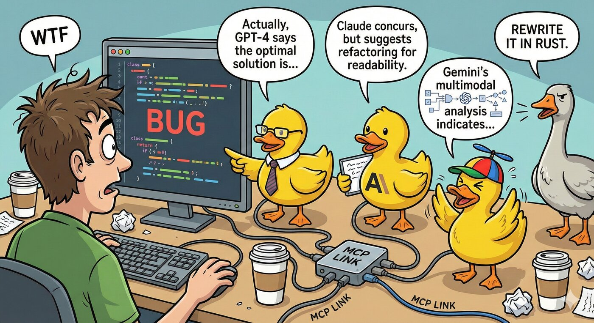

# MCP Rubber Duck

An MCP (Model Context Protocol) server that acts as a bridge to query multiple LLMs -- both OpenAI-compatible HTTP APIs and CLI coding agents. Just like rubber duck debugging, explain your problems to various AI "ducks" and get different perspectives!

[](https://www.npmjs.com/package/mcp-rubber-duck)
[](https://github.com/nesquikm/mcp-rubber-duck/pkgs/container/mcp-rubber-duck)
[](https://registry.modelcontextprotocol.io)

<p align="center">
  
</p>

## Features

- **Universal OpenAI Compatibility** -- Works with any OpenAI-compatible API endpoint
- **CLI Agent Support** -- Use CLI coding agents (Claude Code, Codex, Gemini CLI, Grok, Aider) as ducks
- **Multiple Ducks** -- Configure and query multiple LLM providers simultaneously
- **Conversation Management** -- Maintain context across multiple messages
- **Duck Council** -- Get responses from all your configured LLMs at once
- **Consensus Voting** -- Multi-duck voting with reasoning and confidence scores
- **LLM-as-Judge** -- Have ducks evaluate and rank each other's responses
- **Iterative Refinement** -- Two ducks collaboratively improve responses
- **Structured Debates** -- Oxford, Socratic, and adversarial debate formats
- **MCP Prompts** -- 8 reusable prompt templates for multi-LLM workflows
- **Automatic Failover** -- Falls back to other providers if primary fails
- **Health Monitoring** -- Real-time health checks for all providers
- **Usage Tracking** -- Track requests, tokens, and estimated costs per provider
- **MCP Bridge** -- Connect ducks to other MCP servers for extended functionality ([docs](./docs/mcp-bridge.md))
- **Guardrails** -- Pluggable safety layer with rate limiting, token limits, pattern blocking, and PII redaction ([docs](./docs/guardrails.md))
- **Granular Security** -- Per-server approval controls with session-based approvals
- **Interactive UIs** -- Rich HTML panels for compare, vote, debate, and usage tools (via [MCP Apps](https://github.com/modelcontextprotocol/ext-apps))
- **Tool Annotations** -- MCP-compliant hints for tool behavior (read-only, destructive, etc.)

## Supported Providers

### HTTP Providers (OpenAI-compatible API)

Any provider with an OpenAI-compatible API endpoint, including:

- **OpenAI** (GPT-5.1, o3, o4-mini)
- **Google Gemini** (Gemini 3, Gemini 2.5 Pro/Flash)
- **Anthropic** (via OpenAI-compatible endpoints)
- **Groq** (Llama 4, Llama 3.3)
- **Together AI** (Llama 4, Qwen, and more)
- **Perplexity** (Online models with web search)
- **Anyscale**, **Azure OpenAI**, **Ollama**, **LM Studio**, **Custom**

### CLI Providers (Coding Agents)

Command-line coding agents that run as local processes:

- **Claude Code** (`claude`) -- **Codex** (`codex`) -- **Gemini CLI** (`gemini`) -- **Grok CLI** (`grok`) -- **Aider** (`aider`) -- **Custom**

See [CLI Providers](./docs/cli-providers.md) for full setup and configuration.

## Quick Start

```bash
# Install globally
npm install -g mcp-rubber-duck

# Or use npx directly in Claude Desktop config
npx mcp-rubber-duck
```

**Using Claude Desktop?** Jump to [Claude Desktop Configuration](./docs/claude-desktop.md).
**Using Cursor, VS Code, Windsurf, or another tool?** See the [Setup Guide](./docs/setup.md).

## Installation

### Prerequisites

- Node.js 20 or higher
- npm or yarn
- At least one API key for an HTTP provider, **or** a CLI coding agent installed locally

### Install from NPM

```bash
npm install -g mcp-rubber-duck
```

### Install from Source

```bash
git clone https://github.com/nesquikm/mcp-rubber-duck.git
cd mcp-rubber-duck
npm install
npm run build
npm start
```

## Configuration

Create a `.env` file or `config/config.json`. Key environment variables:

| Variable | Description |
|----------|-------------|
| `OPENAI_API_KEY` | OpenAI API key |
| `GEMINI_API_KEY` | Google Gemini API key |
| `GROQ_API_KEY` | Groq API key |
| `DEFAULT_PROVIDER` | Default provider (e.g., `openai`) |
| `DEFAULT_TEMPERATURE` | Default temperature (e.g., `0.7`) |
| `LOG_LEVEL` | `debug`, `info`, `warn`, `error` |
| `MCP_SERVER` | Set to `true` for MCP server mode |
| `MCP_BRIDGE_ENABLED` | Enable MCP Bridge (ducks access external MCP servers) |
| `CUSTOM_{NAME}_*` | Custom HTTP providers |
| `CLI_{AGENT}_ENABLED` | Enable CLI agents (`CLAUDE`, `CODEX`, `GEMINI`, `GROK`, `AIDER`) |

Full reference: **[Configuration docs](./docs/configuration.md)**

## Interactive UIs (MCP Apps)

Four tools -- `compare_ducks`, `duck_vote`, `duck_debate`, and `get_usage_stats` -- can render rich interactive HTML panels inside supported MCP clients via [MCP Apps](https://github.com/modelcontextprotocol/ext-apps). Once this MCP server is configured in a supporting client, the UIs appear automatically -- no additional setup is required. Clients without MCP Apps support still receive the same plain text output (no functionality is lost). See the [MCP Apps repo](https://github.com/modelcontextprotocol/ext-apps) for an up-to-date list of supported clients.

### Compare Ducks

Compare multiple model responses side-by-side, with latency indicators, token counts, model badges, and error states.

<p align="center">
  
</p>

### Duck Vote

Have multiple ducks vote on options, displayed as a visual vote tally with bar charts, consensus badge, winner card, confidence bars, and collapsible reasoning.

<p align="center">
  
</p>

### Duck Debate

Structured multi-round debate between ducks, shown as a round-by-round view with format badge, participant list, collapsible rounds, and synthesis section.

<p align="center">
  
</p>

### Usage Stats

Usage analytics with summary cards, provider breakdown with expandable rows, token distribution bars, and estimated costs.

<p align="center">
  
</p>

## Available Tools

| Tool | Description |
|------|-------------|
| `ask_duck` | Ask a single question to a specific LLM provider |
| `chat_with_duck` | Conversation with context maintained across messages |
| `clear_conversations` | Clear all conversation history |
| `list_ducks` | List configured providers and health status |
| `list_models` | List available models for providers |
| `compare_ducks` | Ask the same question to multiple providers simultaneously |
| `duck_council` | Get responses from all configured ducks |
| `get_usage_stats` | Usage statistics and estimated costs |
| `duck_vote` | Multi-duck voting with reasoning and confidence |
| `duck_judge` | Have one duck evaluate and rank others' responses |
| `duck_iterate` | Iteratively refine a response between two ducks |
| `duck_debate` | Structured multi-round debate between ducks |
| `mcp_status` | MCP Bridge status and connected servers |
| `get_pending_approvals` | Pending MCP tool approval requests |
| `approve_mcp_request` | Approve or deny a duck's MCP tool request |

Full reference with input schemas: **[Tools docs](./docs/tools.md)**

## Available Prompts

| Prompt | Purpose | Required Arguments |
|--------|---------|-------------------|
| `perspectives` | Multi-angle analysis with assigned lenses | `problem`, `perspectives` |
| `assumptions` | Surface hidden assumptions in plans | `plan` |
| `blindspots` | Hunt for overlooked risks and gaps | `proposal` |
| `tradeoffs` | Structured option comparison | `options`, `criteria` |
| `red_team` | Security/risk analysis from multiple angles | `target` |
| `reframe` | Problem reframing at different levels | `problem` |
| `architecture` | Design review across concerns | `design`, `workloads`, `priorities` |
| `diverge_converge` | Divergent exploration then convergence | `challenge` |

Full reference with examples: **[Prompts docs](./docs/prompts.md)**

## Development

```bash
npm run dev        # Development with watch mode
npm test           # Run all tests
npm run lint       # ESLint
npm run typecheck  # Type check without emit
```

## [Documentation](./docs/README.md)

| Topic | Link |
|-------|------|
| **Setup guide (all tools)** | **[docs/setup.md](./docs/setup.md)** |
| Full configuration reference | [docs/configuration.md](./docs/configuration.md) |
| Claude Desktop setup | [docs/claude-desktop.md](./docs/claude-desktop.md) |
| All tools with schemas | [docs/tools.md](./docs/tools.md) |
| Prompt templates | [docs/prompts.md](./docs/prompts.md) |
| CLI coding agents | [docs/cli-providers.md](./docs/cli-providers.md) |
| MCP Bridge | [docs/mcp-bridge.md](./docs/mcp-bridge.md) |
| Guardrails | [docs/guardrails.md](./docs/guardrails.md) |
| Docker deployment | [docs/docker.md](./docs/docker.md) |
| Provider-specific setup | [docs/provider-setup.md](./docs/provider-setup.md) |
| Usage examples | [docs/usage-examples.md](./docs/usage-examples.md) |
| Architecture | [docs/architecture.md](./docs/architecture.md) |
| Roadmap | [docs/roadmap.md](./docs/roadmap.md) |

## Troubleshooting

### Provider Not Working
1. Check API key is correctly set
2. Verify endpoint URL is correct
3. Run health check: `list_ducks({ check_health: true })`
4. Check logs for detailed error messages

### Connection Issues
- For local providers (Ollama, LM Studio), ensure they're running
- Check firewall settings for local endpoints
- Verify network connectivity to cloud providers

### Rate Limiting
- Configure failover to alternate providers
- Adjust `max_retries` and `timeout` settings
- See [Guardrails](./docs/guardrails.md) for rate limiting configuration

## Contributing

```
     __
   <(o )___
    ( ._> /
     `---'  Quack! Ready to debug!
```

We love contributions! Whether you're fixing bugs, adding features, or teaching our ducks new tricks, we'd love to have you join the flock.

Check out our [Contributing Guide](./CONTRIBUTING.md) to get started.

**Quick start for contributors:**
1. Fork the repository
2. Create a feature branch
3. Follow our [conventional commit guidelines](./CONTRIBUTING.md#commit-messages-duck-communication-protocol)
4. Add tests for new functionality
5. Submit a pull request

## License

MIT License - see LICENSE file for details

## Acknowledgments

- Inspired by the rubber duck debugging method
- Built on the Model Context Protocol (MCP)
- Uses OpenAI SDK for HTTP provider compatibility
- Supports CLI coding agents (Claude Code, Codex, Gemini CLI, Grok, Aider)

## Changelog

See [CHANGELOG.md](./CHANGELOG.md) for a detailed history of changes and releases.

## Registry & Directory

- **NPM Package**: [npmjs.com/package/mcp-rubber-duck](https://www.npmjs.com/package/mcp-rubber-duck)
- **Docker Images**: [ghcr.io/nesquikm/mcp-rubber-duck](https://github.com/nesquikm/mcp-rubber-duck/pkgs/container/mcp-rubber-duck)
- **MCP Registry**: Official MCP server `io.github.nesquikm/rubber-duck`
- **Glama Directory**: [glama.ai/mcp/servers/@nesquikm/mcp-rubber-duck](https://glama.ai/mcp/servers/@nesquikm/mcp-rubber-duck)
- **Awesome MCP Servers**: Listed in the [community directory](https://github.com/punkpeye/awesome-mcp-servers)

## Support

- Report issues: https://github.com/nesquikm/mcp-rubber-duck/issues
- Documentation: https://github.com/nesquikm/mcp-rubber-duck/wiki
- Discussions: https://github.com/nesquikm/mcp-rubber-duck/discussions

---

Happy Debugging with your AI Duck Panel!
