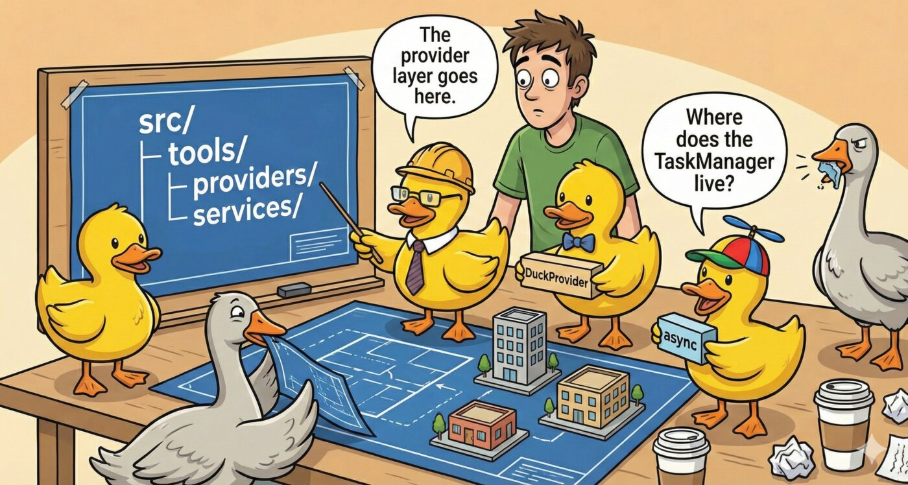

# Architecture

<p align="center">
  
</p>

```
mcp-rubber-duck/
├── src/
│   ├── server.ts           # MCP server implementation
│   ├── config/             # Configuration management
│   ├── data/               # Default pricing data
│   ├── guardrails/         # Safety & compliance plugins
│   ├── providers/          # Provider abstraction layer
│   │   ├── types.ts        # IDuckProvider interface
│   │   ├── provider.ts     # DuckProvider (HTTP/OpenAI SDK)
│   │   ├── manager.ts      # ProviderManager factory
│   │   └── cli/            # CLI subprocess providers
│   │       ├── cli-provider.ts   # CLIDuckProvider
│   │       ├── presets.ts        # Built-in CLI tool presets
│   │       ├── output-parsers.ts # Text/JSON/JSONL parsers
│   │       └── process-runner.ts # child_process.spawn wrapper
│   ├── tools/              # MCP tool implementations
│   ├── prompts/            # MCP prompt templates
│   ├── services/           # Health, conversations
│   ├── ui/                 # Interactive UI apps (MCP Apps)
│   └── utils/              # Logging, ASCII art
├── config/                 # Configuration examples
└── tests/                  # Test suites
```

## Tool Annotations

All tools include MCP-compliant annotations that describe their behavioral characteristics:

| Annotation | Meaning |
|------------|---------|
| `readOnlyHint` | Tool doesn't modify any state |
| `destructiveHint` | Tool performs irreversible operations |
| `idempotentHint` | Tool is safe to retry multiple times |
| `openWorldHint` | Tool accesses external systems (APIs, network) |

These help MCP clients make informed decisions about tool execution and user confirmations.

## Async Task Support

Long-running tools (`duck_iterate`, `duck_debate`) use the MCP SDK's experimental Tasks API for async execution. Instead of blocking the client, they return a task handle that can be polled for progress and results.

- **Progress reporting** -- All multi-provider tools (`compare_ducks`, `duck_council`, `duck_vote`, `duck_debate`, `duck_iterate`) emit `notifications/progress` as each provider responds.
- **Cancellation** -- Task-based tools accept an `AbortSignal`, checked between rounds, allowing clients to cancel mid-execution.
- **Task lifecycle** -- Managed by `TaskManager` (`src/services/task-manager.ts`), which wraps `InMemoryTaskStore` and handles background work, cancellation, and cleanup on shutdown.
