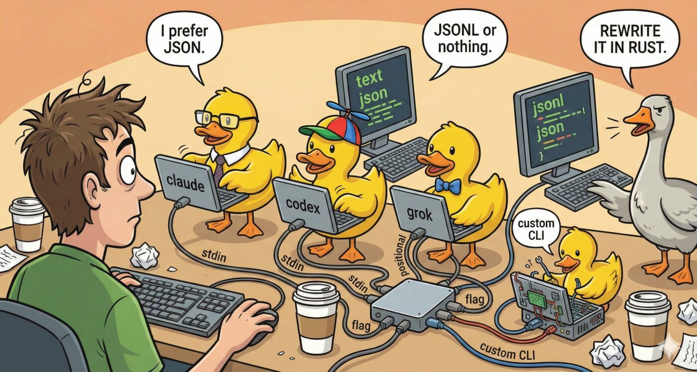

# CLI Providers - Coding Agents as Ducks

<p align="center">
  
</p>

Use CLI coding agents as ducks alongside HTTP providers. CLI providers spawn a local process, pipe the prompt, and parse the output -- no API key required.

## Preset Agents

Enable known CLI agents with a single env var:

```bash
CLI_CLAUDE_ENABLED=true    # Uses `claude` command with JSON output
CLI_CODEX_ENABLED=true     # Uses `codex exec` with JSONL output
CLI_GEMINI_ENABLED=true    # Uses `gemini` command with JSON output
CLI_GROK_ENABLED=true      # Uses `grok` command with text output
CLI_AIDER_ENABLED=true     # Uses `aider --message` with text output
```

Each preset comes with sensible defaults for command, arguments, prompt delivery, and output parsing. You can override any default:

```bash
CLI_CLAUDE_NICKNAME=My Claude Agent
CLI_CLAUDE_DEFAULT_MODEL=claude-sonnet-4-20250514
CLI_CLAUDE_CLI_ARGS=--max-turns,5,--verbose
CLI_CLAUDE_SYSTEM_PROMPT=Be concise and technical
```

## Custom CLI Providers

Add any CLI tool as a duck. You can configure **multiple custom CLI providers** -- each unique `{NAME}` in `CLI_CUSTOM_{NAME}_*` becomes a separate duck:

```bash
# First custom CLI duck: "cli-mytool"
CLI_CUSTOM_MYTOOL_COMMAND=/usr/local/bin/my-llm
CLI_CUSTOM_MYTOOL_NICKNAME=My LLM Tool
CLI_CUSTOM_MYTOOL_PROMPT_DELIVERY=stdin          # flag, positional, or stdin
CLI_CUSTOM_MYTOOL_OUTPUT_FORMAT=text             # text, json, or jsonl
CLI_CUSTOM_MYTOOL_PROMPT_FLAG=-p                 # Required when delivery=flag
CLI_CUSTOM_MYTOOL_DEFAULT_MODEL=my-model         # Optional
CLI_CUSTOM_MYTOOL_CLI_ARGS=--verbose,--no-color  # Optional: comma-separated
CLI_CUSTOM_MYTOOL_PROCESS_TIMEOUT=300000         # Optional: ms (default: 120000)
CLI_CUSTOM_MYTOOL_WORKING_DIRECTORY=/projects    # Optional

# Second custom CLI duck: "cli-localllm"
CLI_CUSTOM_LOCALLLM_COMMAND=ollama
CLI_CUSTOM_LOCALLLM_NICKNAME=Local Ollama CLI
CLI_CUSTOM_LOCALLLM_PROMPT_DELIVERY=positional
CLI_CUSTOM_LOCALLLM_CLI_ARGS=run,llama3.2

# Third custom CLI duck: "cli-myagent"
CLI_CUSTOM_MYAGENT_COMMAND=/home/user/bin/my-agent
CLI_CUSTOM_MYAGENT_NICKNAME=My Custom Agent
CLI_CUSTOM_MYAGENT_PROMPT_DELIVERY=stdin
CLI_CUSTOM_MYAGENT_OUTPUT_FORMAT=json
```

Each custom CLI provider appears as `cli-{name}` (lowercase) in the duck list.

## Prompt Delivery Methods

| Method | Description | Example |
|--------|-------------|---------|
| `flag` | Prompt passed via a CLI flag | `tool -p "prompt"` |
| `positional` | Prompt as a positional argument | `tool "prompt"` |
| `stdin` | Prompt piped via stdin | `echo "prompt" \| tool` |

## Output Formats

| Format | Description | Use Case |
|--------|-------------|----------|
| `text` | Raw text output (trimmed) | Aider, Grok, simple tools |
| `json` | Single JSON object with path extraction | Claude Code, Gemini CLI |
| `jsonl` | Newline-delimited JSON (last result used) | Codex |

For `json` and `jsonl` formats, the response is extracted using a JSONPath-like `response_json_path` (configured in presets or via config file).

## Claude Desktop with CLI Providers

```json
{
  "mcpServers": {
    "rubber-duck": {
      "command": "mcp-rubber-duck",
      "env": {
        "MCP_SERVER": "true",
        "OPENAI_API_KEY": "your-openai-api-key-here",
        "CLI_CLAUDE_ENABLED": "true",
        "CLI_AIDER_ENABLED": "true"
      }
    }
  }
}
```

CLI ducks appear alongside HTTP ducks in `list_ducks` and can be used with all multi-agent tools (`compare_ducks`, `duck_council`, `duck_vote`, etc.).

## Config File (Alternative to Env Vars)

CLI providers can also be configured via `config/config.json`. Set `"type": "cli"` to distinguish from HTTP providers:

```json
{
  "providers": {
    "openai": {
      "api_key": "sk-...",
      "base_url": "https://api.openai.com/v1",
      "models": ["gpt-5.1"],
      "default_model": "gpt-5.1",
      "nickname": "GPT Duck"
    },
    "cli-claude": {
      "type": "cli",
      "cli_type": "claude",
      "nickname": "Claude Agent",
      "system_prompt": "Be concise"
    },
    "cli-custom": {
      "type": "cli",
      "cli_type": "custom",
      "cli_command": "/usr/local/bin/my-llm",
      "prompt_delivery": "stdin",
      "output_format": "text",
      "nickname": "My Tool"
    }
  }
}
```

See `config/config.example.json` for the full example including all preset and custom CLI providers. Existing HTTP-only configs continue to work unchanged (providers without `"type"` default to `"http"`).

## CLI Provider Limitations

CLI coding agents work differently from HTTP providers and have some important limitations:

### MCP Bridge Not Supported

CLI ducks **cannot use the MCP Bridge feature**. They have their own native tool systems that would conflict with injected MCP tools. Instead, configure MCP servers directly in each CLI tool's native config:

```bash
# Codex - add MCP servers via its CLI
codex mcp add context7 --url https://mcp.context7.com/mcp
codex mcp add chrome -- npx chrome-devtools-mcp@latest

# Gemini CLI - add MCP servers via its CLI
gemini mcp add context7 https://mcp.context7.com/mcp -t http -s user --trust
gemini mcp add chrome "npx chrome-devtools-mcp@latest" -s user --trust
```

### Non-Interactive Mode Differences

| Feature | Codex | Gemini CLI |
|---------|-------|------------|
| HTTP MCP servers (e.g., context7) | Works | Works |
| Stdio MCP servers (e.g., chrome) | Auto-launches | Must be pre-running |
| Launch Chrome on demand | Yes | No |
| Use already-running Chrome | Yes | Yes |

**Workaround for Gemini + Chrome**: Use Codex to launch Chrome first, then Gemini can connect to the already-running instance:

```
1. Ask Codex duck to open Chrome (it auto-launches with debugging)
2. Ask Gemini duck to use Chrome (connects to existing instance)
```

This limitation exists because Gemini CLI only activates MCP servers in interactive mode, not when invoked with the `-p` flag for single prompts.
