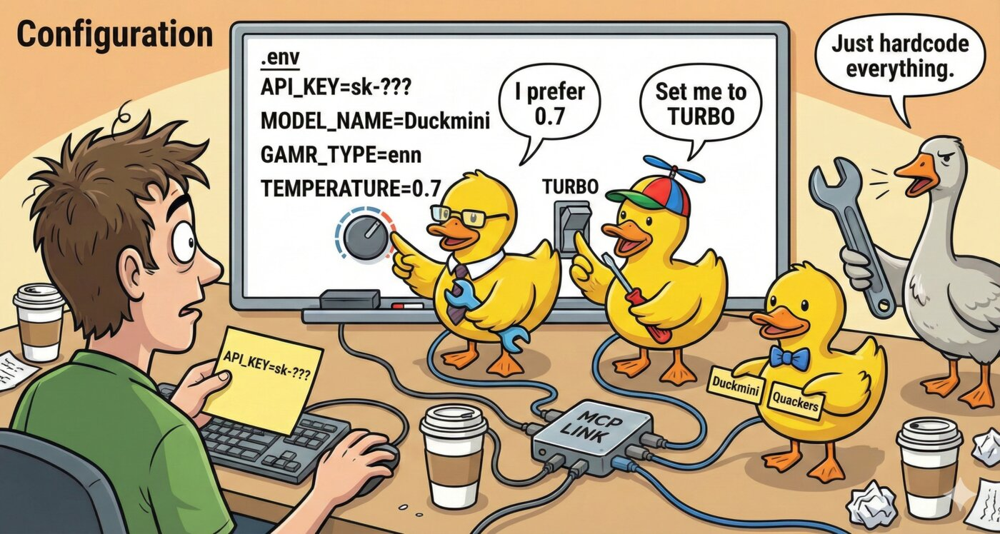

# Configuration

<p align="center">
  
</p>

MCP Rubber Duck can be configured via environment variables or a JSON configuration file.

## Method 1: Environment Variables

Create a `.env` file in the project root:

```env
# OpenAI
OPENAI_API_KEY=sk-...
OPENAI_DEFAULT_MODEL=gpt-5.1  # Optional: defaults to gpt-5.1

# Google Gemini
GEMINI_API_KEY=...
GEMINI_DEFAULT_MODEL=gemini-2.5-flash  # Optional: defaults to gemini-2.5-flash

# Groq
GROQ_API_KEY=gsk_...
GROQ_DEFAULT_MODEL=llama-3.3-70b-versatile  # Optional: defaults to llama-3.3-70b-versatile

# Ollama (Local)
OLLAMA_BASE_URL=http://localhost:11434/v1  # Optional
OLLAMA_DEFAULT_MODEL=llama3.2  # Optional: defaults to llama3.2

# Custom Providers (you can add multiple)
# Format: CUSTOM_{NAME}_* where NAME becomes the provider key (lowercase)

# Example: Add provider "myapi"
CUSTOM_MYAPI_API_KEY=...
CUSTOM_MYAPI_BASE_URL=https://api.example.com/v1
CUSTOM_MYAPI_DEFAULT_MODEL=custom-model  # Optional
CUSTOM_MYAPI_MODELS=model1,model2        # Optional: comma-separated list
CUSTOM_MYAPI_NICKNAME=My Custom Duck     # Optional: display name

# Example: Add provider "azure"
CUSTOM_AZURE_API_KEY=...
CUSTOM_AZURE_BASE_URL=https://mycompany.openai.azure.com/v1

# CLI Providers (coding agents as ducks)
# Enable preset CLI agents
CLI_CLAUDE_ENABLED=true                      # Claude Code CLI
CLI_CODEX_ENABLED=true                       # OpenAI Codex CLI
CLI_GEMINI_ENABLED=true                      # Gemini CLI
CLI_GROK_ENABLED=true                        # Grok CLI
CLI_AIDER_ENABLED=true                       # Aider

# Optional overrides for preset CLI agents
CLI_CLAUDE_NICKNAME=My Claude                # Optional: display name
CLI_CLAUDE_DEFAULT_MODEL=claude-sonnet-4-20250514  # Optional: model override
CLI_CLAUDE_SYSTEM_PROMPT=Be concise          # Optional: system prompt
CLI_CLAUDE_CLI_ARGS=--max-turns,5,--verbose  # Optional: extra CLI args

# Custom CLI providers (any CLI tool)
CLI_CUSTOM_MYTOOL_COMMAND=/usr/local/bin/mytool
CLI_CUSTOM_MYTOOL_NICKNAME=My Tool
CLI_CUSTOM_MYTOOL_PROMPT_DELIVERY=stdin      # flag, positional, or stdin
CLI_CUSTOM_MYTOOL_OUTPUT_FORMAT=text         # text, json, or jsonl
CLI_CUSTOM_MYTOOL_PROCESS_TIMEOUT=60000      # Optional: ms (default: 120000)
CLI_CUSTOM_MYTOOL_WORKING_DIRECTORY=/tmp     # Optional: working directory

# Global Settings
DEFAULT_PROVIDER=openai
DEFAULT_TEMPERATURE=0.7
LOG_LEVEL=info

# MCP Bridge Settings (Optional)
MCP_BRIDGE_ENABLED=true                      # Enable ducks to access external MCP servers
MCP_APPROVAL_MODE=trusted                    # always, trusted, or never
MCP_APPROVAL_TIMEOUT=300                     # seconds

# MCP Server: Context7 Documentation (Example)
MCP_SERVER_CONTEXT7_TYPE=http
MCP_SERVER_CONTEXT7_URL=https://mcp.context7.com/mcp
MCP_SERVER_CONTEXT7_ENABLED=true

# Per-server trusted tools
MCP_TRUSTED_TOOLS_CONTEXT7=*                 # Trust all Context7 tools

# Optional: Custom Duck Nicknames (Have fun with these!)
OPENAI_NICKNAME="DUCK-4"              # Optional: defaults to "GPT Duck"
GEMINI_NICKNAME="Duckmini"            # Optional: defaults to "Gemini Duck"
GROQ_NICKNAME="Quackers"              # Optional: defaults to "Groq Duck"
OLLAMA_NICKNAME="Local Quacker"       # Optional: defaults to "Local Duck"
# For custom providers, use: CUSTOM_{NAME}_NICKNAME (see custom provider section above)
```

**Note:** Duck nicknames are completely optional! If you don't set them, you'll get the charming defaults (GPT Duck, Gemini Duck, etc.). If you use a `config.json` file, those nicknames take priority over environment variables.

## Method 2: Configuration File

Create a `config/config.json` file based on the example:

```bash
cp config/config.example.json config/config.json
# Edit config/config.json with your API keys and preferences
```

See also: [CLI Providers](./cli-providers.md) for CLI-specific configuration, [MCP Bridge](./mcp-bridge.md) for bridge settings, [Guardrails](./guardrails.md) for safety configuration.
