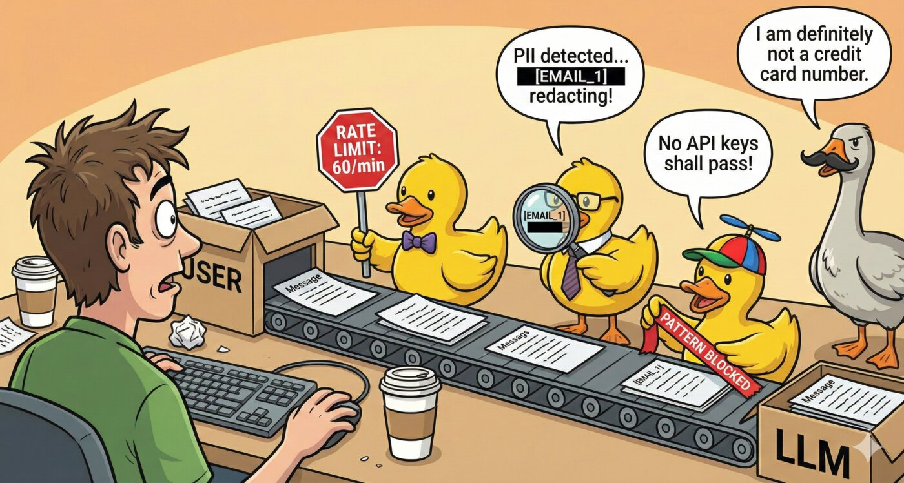

# Guardrails - Safety & Compliance Layer

<p align="center">
  
</p>

Guardrails provide a pluggable safety and compliance layer that intercepts LLM requests and responses. Protect against rate abuse, limit token usage, block sensitive patterns, and automatically redact PII.

## Quick Setup

```bash
# Enable guardrails with PII protection
GUARDRAILS_ENABLED="true"
GUARDRAILS_PII_REDACTOR_ENABLED="true"
GUARDRAILS_PII_REDACTOR_ALLOWLIST_DOMAINS="mycompany.com"
```

## Global Settings

| Variable | Type | Default | Description |
|----------|------|---------|-------------|
| `GUARDRAILS_ENABLED` | boolean | `false` | Master switch for guardrails system |
| `GUARDRAILS_LOG_VIOLATIONS` | boolean | `true` | Log when guardrails detect violations |
| `GUARDRAILS_LOG_MODIFICATIONS` | boolean | `false` | Log when guardrails modify content |
| `GUARDRAILS_FAIL_OPEN` | boolean | `false` | If `true`, allow requests when guardrails error; if `false`, block on error |

## Rate Limiter

Prevent API abuse by limiting request frequency.

```bash
GUARDRAILS_RATE_LIMITER_ENABLED="true"
GUARDRAILS_RATE_LIMITER_REQUESTS_PER_MINUTE="60"
GUARDRAILS_RATE_LIMITER_REQUESTS_PER_HOUR="500"
GUARDRAILS_RATE_LIMITER_PER_PROVIDER="true"      # Track limits per provider
GUARDRAILS_RATE_LIMITER_BURST_ALLOWANCE="5"      # Extra requests for short bursts
```

| Variable | Type | Default | Description |
|----------|------|---------|-------------|
| `GUARDRAILS_RATE_LIMITER_ENABLED` | boolean | `false` | Enable rate limiting |
| `GUARDRAILS_RATE_LIMITER_REQUESTS_PER_MINUTE` | number | `60` | Max requests per minute |
| `GUARDRAILS_RATE_LIMITER_REQUESTS_PER_HOUR` | number | `1000` | Max requests per hour |
| `GUARDRAILS_RATE_LIMITER_PER_PROVIDER` | boolean | `false` | Track limits per provider vs global |
| `GUARDRAILS_RATE_LIMITER_BURST_ALLOWANCE` | number | `5` | Extra requests allowed for bursts |

## Token Limiter

Control token usage for cost management.

```bash
GUARDRAILS_TOKEN_LIMITER_ENABLED="true"
GUARDRAILS_TOKEN_LIMITER_MAX_INPUT_TOKENS="100000"
GUARDRAILS_TOKEN_LIMITER_MAX_OUTPUT_TOKENS="16000"
GUARDRAILS_TOKEN_LIMITER_WARN_AT_PERCENTAGE="80"
```

| Variable | Type | Default | Description |
|----------|------|---------|-------------|
| `GUARDRAILS_TOKEN_LIMITER_ENABLED` | boolean | `false` | Enable token limiting |
| `GUARDRAILS_TOKEN_LIMITER_MAX_INPUT_TOKENS` | number | `8192` | Max tokens in input prompt |
| `GUARDRAILS_TOKEN_LIMITER_MAX_OUTPUT_TOKENS` | number | - | Max tokens in response |
| `GUARDRAILS_TOKEN_LIMITER_WARN_AT_PERCENTAGE` | number | `80` | Warn when usage hits this % |

## Pattern Blocker

Block or redact sensitive patterns in requests.

```bash
GUARDRAILS_PATTERN_BLOCKER_ENABLED="true"
GUARDRAILS_PATTERN_BLOCKER_PATTERNS="confidential,internal-only"
GUARDRAILS_PATTERN_BLOCKER_PATTERNS_REGEX="secret-\\d{4}"
GUARDRAILS_PATTERN_BLOCKER_CASE_SENSITIVE="false"
GUARDRAILS_PATTERN_BLOCKER_ACTION="block"        # block, warn, or redact
```

| Variable | Type | Default | Description |
|----------|------|---------|-------------|
| `GUARDRAILS_PATTERN_BLOCKER_ENABLED` | boolean | `false` | Enable pattern blocking |
| `GUARDRAILS_PATTERN_BLOCKER_PATTERNS` | string | - | Comma-separated literal patterns |
| `GUARDRAILS_PATTERN_BLOCKER_PATTERNS_REGEX` | string | - | Comma-separated regex patterns |
| `GUARDRAILS_PATTERN_BLOCKER_CASE_SENSITIVE` | boolean | `false` | Case-sensitive matching |
| `GUARDRAILS_PATTERN_BLOCKER_ACTION` | string | `block` | Action: `block`, `warn`, or `redact` |

## PII Redactor

Automatically detect and redact personally identifiable information.

```bash
GUARDRAILS_PII_REDACTOR_ENABLED="true"
GUARDRAILS_PII_REDACTOR_DETECT_EMAILS="true"
GUARDRAILS_PII_REDACTOR_DETECT_PHONES="true"
GUARDRAILS_PII_REDACTOR_DETECT_SSN="true"
GUARDRAILS_PII_REDACTOR_DETECT_API_KEYS="true"
GUARDRAILS_PII_REDACTOR_DETECT_CREDIT_CARDS="true"
GUARDRAILS_PII_REDACTOR_DETECT_IP_ADDRESSES="true"
GUARDRAILS_PII_REDACTOR_ALLOWLIST_DOMAINS="gmail.com,company.com"
GUARDRAILS_PII_REDACTOR_RESTORE_ON_RESPONSE="true"
```

| Variable | Type | Default | Description |
|----------|------|---------|-------------|
| `GUARDRAILS_PII_REDACTOR_ENABLED` | boolean | `false` | Enable PII detection/redaction |
| `GUARDRAILS_PII_REDACTOR_DETECT_EMAILS` | boolean | `true` | Detect email addresses |
| `GUARDRAILS_PII_REDACTOR_DETECT_PHONES` | boolean | `true` | Detect phone numbers |
| `GUARDRAILS_PII_REDACTOR_DETECT_SSN` | boolean | `true` | Detect US Social Security Numbers |
| `GUARDRAILS_PII_REDACTOR_DETECT_API_KEYS` | boolean | `true` | Detect API keys (sk-*, gsk_*, etc.) |
| `GUARDRAILS_PII_REDACTOR_DETECT_CREDIT_CARDS` | boolean | `true` | Detect credit card numbers |
| `GUARDRAILS_PII_REDACTOR_DETECT_IP_ADDRESSES` | boolean | `false` | Detect IPv4 addresses |
| `GUARDRAILS_PII_REDACTOR_ALLOWLIST` | string | - | Comma-separated exact values to skip |
| `GUARDRAILS_PII_REDACTOR_ALLOWLIST_DOMAINS` | string | - | Comma-separated email domains to skip |
| `GUARDRAILS_PII_REDACTOR_RESTORE_ON_RESPONSE` | boolean | `false` | Restore original PII in responses |
| `GUARDRAILS_PII_REDACTOR_LOG_DETECTIONS` | boolean | `true` | Log when PII is detected |

**How PII Redaction Works:**
1. User sends: `"Contact john@secret.com for details"`
2. Pre-request: Redacted to `"Contact [EMAIL_1] for details"`
3. LLM processes the redacted text
4. Post-response: If `restore_on_response=true`, `[EMAIL_1]` -> `john@secret.com`

## Example: Full Production Config

```bash
# Enable guardrails
GUARDRAILS_ENABLED="true"
GUARDRAILS_LOG_VIOLATIONS="true"

# Rate limiting
GUARDRAILS_RATE_LIMITER_ENABLED="true"
GUARDRAILS_RATE_LIMITER_REQUESTS_PER_MINUTE="60"
GUARDRAILS_RATE_LIMITER_REQUESTS_PER_HOUR="500"

# Token limits
GUARDRAILS_TOKEN_LIMITER_ENABLED="true"
GUARDRAILS_TOKEN_LIMITER_MAX_INPUT_TOKENS="100000"
GUARDRAILS_TOKEN_LIMITER_MAX_OUTPUT_TOKENS="16000"

# Block sensitive patterns
GUARDRAILS_PATTERN_BLOCKER_ENABLED="true"
GUARDRAILS_PATTERN_BLOCKER_PATTERNS="confidential,internal-only"
GUARDRAILS_PATTERN_BLOCKER_ACTION="warn"

# PII protection
GUARDRAILS_PII_REDACTOR_ENABLED="true"
GUARDRAILS_PII_REDACTOR_ALLOWLIST_DOMAINS="gmail.com,company.com"
GUARDRAILS_PII_REDACTOR_RESTORE_ON_RESPONSE="true"
```

## Guardrail Phases

Guardrails intercept at multiple points in the request lifecycle:

| Phase | Description | Plugins |
|-------|-------------|---------|
| `pre_request` | Before sending to LLM | Rate limiter, Token limiter, Pattern blocker, PII redactor |
| `post_response` | After receiving from LLM | Token limiter, PII redactor (restore) |
| `pre_tool_input` | Before MCP tool execution | PII redactor |
| `post_tool_output` | After MCP tool returns | PII redactor (restore) |
