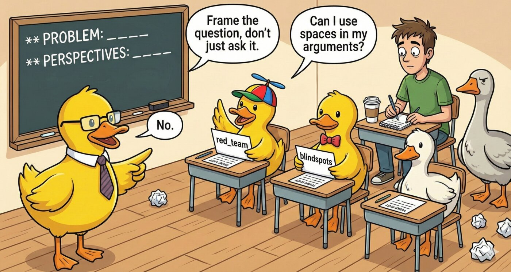

# Available Prompts

<p align="center">
  
</p>

MCP Prompts are reusable templates that help you structure questions for multi-LLM analysis. Access them via `/` commands in Claude Desktop or other MCP clients.

**Key Concept**: Unlike tools (which execute actions), prompts help you *frame your questions* to get better multi-perspective responses from multiple LLMs.

| Prompt | Purpose | Required Arguments |
|--------|---------|-------------------|
| `perspectives` | Multi-angle analysis with assigned lenses | `problem`, `perspectives` |
| `assumptions` | Surface hidden assumptions in plans | `plan` |
| `blindspots` | Hunt for overlooked risks and gaps | `proposal` |
| `tradeoffs` | Structured option comparison | `options`, `criteria` |
| `red_team` | Security/risk analysis from multiple angles | `target` |
| `reframe` | Problem reframing at different levels | `problem` |
| `architecture` | Design review across concerns | `design`, `workloads`, `priorities` |
| `diverge_converge` | Divergent exploration then convergence | `challenge` |

## Example: Using `perspectives` with Duck Council

The most reliable way to use prompts is as templates with duck tools:

```
Use duck_council with this prompt:

"Analyze this problem from multiple perspectives:

**PROBLEM:** Review this authentication middleware for our API

**PERSPECTIVES:** security, performance, maintainability, error handling

**CONTEXT:** [paste your code here]

Each LLM should adopt ONE lens and provide targeted analysis from that viewpoint."
```

## Example: Using `tradeoffs` with Compare Ducks

```
Use compare_ducks with this prompt:

"Analyze these technical options:

**OPTIONS:** PostgreSQL, MongoDB, Redis

**CRITERIA:** scalability, query flexibility, operational complexity, cost

**CONTEXT:** Real-time analytics dashboard with 10k concurrent users

Score each option against each criterion (1-5) and identify the biggest trade-off."
```

This approach works reliably and leverages multi-LLM analysis.

## Known Limitations (Claude Code)

MCP prompts are correctly implemented per the [MCP specification](https://modelcontextprotocol.io/specification/2025-06-18/server/prompts), but Claude Code's support for MCP prompts has limitations:

| Issue | Status | Workaround |
|-------|--------|------------|
| Must type `(MCP)` suffix | Required | Use `/rubber-duck:reframe (MCP)` not `/rubber-duck:reframe` |
| Arguments with spaces broken | [Won't fix](https://github.com/anthropics/claude-code/issues/6657) | Use single words: `problem="checkout-abandonment"` |
| Argument hints not shown | Missing | See table above for required arguments |
| Optional-only prompts need input | [Won't fix](https://github.com/anthropics/claude-code/issues/5597) | Type at least one character |

**Example that works:**
```
/rubber-duck:reframe (MCP) problem="slow-api-responses"
```

**Example that fails:**
```
/rubber-duck:reframe (MCP) problem="Users abandon checkout at payment"
                                    ^ spaces break argument parsing
```

## Recommended: Use Prompts as Templates

For the best experience, use prompts as templates with duck tools directly. Copy the prompt structure and send to `duck_council`, `compare_ducks`, or `ask_duck`:

```
Use duck_council with this prompt:

"Analyze this problem from multiple perspectives:

**PROBLEM:** Users abandon checkout at payment step

**PERSPECTIVES:** security, UX, performance, reliability

Each LLM should adopt ONE lens and provide targeted analysis."
```

This approach:
- Works reliably with full argument text
- Leverages multi-LLM tools (council, compare, vote)
- No Claude Code parsing issues
