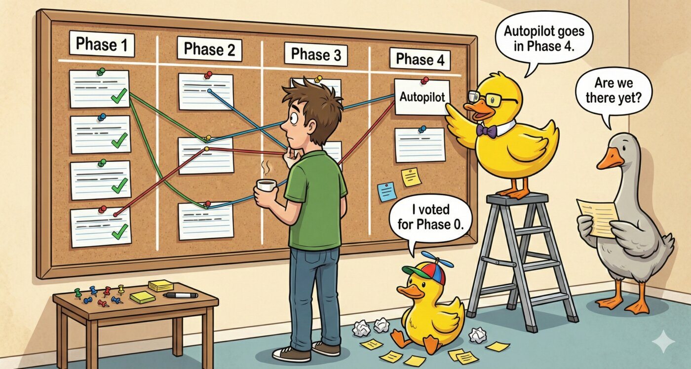

# MCP Rubber Duck Roadmap

  

*Last updated: February 2026*

## Recommended Feature Priority

### Tier 1 - Platform Foundation

| # | Feature | Issue | Impact | Effort |
|---|---------|-------|--------|--------|
| 1 | outputSchema for voting/consensus tools | [#53](https://github.com/nesquikm/mcp-rubber-duck/issues/53) | High | Low-Medium |
| 2 | Streamable HTTP transport + Streaming responses | [#57](https://github.com/nesquikm/mcp-rubber-duck/issues/57), [#47](https://github.com/nesquikm/mcp-rubber-duck/issues/47) | High | Medium |
| 3 | MCP Resources + resource_link | [#48](https://github.com/nesquikm/mcp-rubber-duck/issues/48), [#56](https://github.com/nesquikm/mcp-rubber-duck/issues/56) | Medium-High | Medium |

### Tier 2 - Differentiation

| # | Feature | Issue | Impact | Effort |
|---|---------|-------|--------|--------|
| 4 | Duck Deliberate - Tree-of-Thoughts | [#35](https://github.com/nesquikm/mcp-rubber-duck/issues/35) | High | High |
| 5 | Duck Hypothesis - Scientific debugging | [#45](https://github.com/nesquikm/mcp-rubber-duck/issues/45) | High | Medium |
| 6 | Duck Calibrate - Uncertainty quantification | [#40](https://github.com/nesquikm/mcp-rubber-duck/issues/40) | Medium | Low |

### Tier 3 - Advanced Orchestration

| # | Feature | Issue | Impact | Effort |
|---|---------|-------|--------|--------|
| 7 | Smart Router + Fallback Chains | [#10](https://github.com/nesquikm/mcp-rubber-duck/issues/10), [#20](https://github.com/nesquikm/mcp-rubber-duck/issues/20) | Medium-High | Medium-High |
| 8 | Duck Autopilot | [#12](https://github.com/nesquikm/mcp-rubber-duck/issues/12) | High | High |
| 9 | Duck Ecosystem - Specialized personas | [#44](https://github.com/nesquikm/mcp-rubber-duck/issues/44) | Medium | Medium |

### Cross-cutting

| Feature | Issue | Impact | Effort |
|---------|-------|--------|--------|
| Elicitation - Human-in-the-loop | [#60](https://github.com/nesquikm/mcp-rubber-duck/issues/60) | Medium-High | Low-Medium |

## Suggested Phases

- **Phase 1** (Foundation): outputSchema (#53) → Streamable HTTP (#57) + Streaming (#47)
- **Phase 2** (Differentiation): Duck Hypothesis (#45) + Duck Calibrate (#40) + Duck Deliberate (#35)
- **Phase 3** (Platform): Resources (#48) + Smart Router (#10) + Fallback Chains (#20)
- **Phase 4** (Agentic): Duck Autopilot (#12)

## What We Already Have

| Feature | Status | Details |
|---------|--------|---------|
| MCP Apps / Ext-Apps | Done | 4 interactive UIs: compare, vote, debate, usage-stats |
| Streaming / Progress | Done | `ProgressReporter` via MCP `notifications/progress` |
| Async / Tasks | Done | MCP experimental tasks API with cancellation |
| Structured output | Partial | Dual-content workaround, no formal `outputSchema` → #53 |

## Client Support Matrix

| Feature | Claude Desktop | Claude Code | Cursor | VS Code/Copilot | Zed |
|---------|---------------|-------------|--------|-----------------|-----|
| outputSchema | - | - | Yes | Yes | Yes |
| Elicitation | - | - | Yes | Yes | - |
| Async Tasks | - | - | - | Partial | - |
| Streaming Progress | - | - | Partial | Yes | - |
| resource_link | Partial | Partial | Yes | Yes | Yes |
| listChanged | - | - | Yes | Yes | Yes |

## Research References

- [MCP Roadmap](https://modelcontextprotocol.io/development/roadmap)
- [MCP Apps Extension](https://blog.modelcontextprotocol.io/posts/2026-01-26-mcp-apps/)
- [Google gRPC for MCP](https://www.infoq.com/news/2026/02/google-grpc-mcp-transport/)
- [MCP Spec Updates (June 2025)](https://forgecode.dev/blog/mcp-spec-updates/)
- [Multi-Agent Collaboration Survey](https://arxiv.org/abs/2501.06322)
- [Tree of Thoughts](https://arxiv.org/abs/2305.10601) - 74% vs 4% success on hard problems
- [KVCOMM](https://arxiv.org/abs/2510.12872) - KV-cache sharing, 70%+ reuse rate
