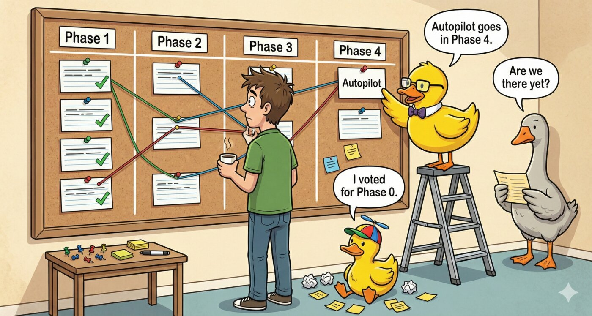

# MCP Rubber Duck Roadmap

  

*Last updated: June 2026*

## Next Up (June 2026 research)

A multi-agent research pass (codebase audit + MCP-spec frontier + competitive landscape + 2025–26 LLM literature) produced these picks:

1. **Debiased `duck_judge` Panel** ([#119](https://github.com/nesquikm/mcp-rubber-duck/issues/119)) — *top pick.* Harden the least-developed consensus tool into a multi-provider judge panel: position-bias swap-and-average, criterion-separated rubric, Borda/mean-rank across heterogeneous judges, agreement-derived confidence, and the `outputSchema` it currently lacks. Lands on the project's structural moat (a judge can't cancel its own bias; inter-judge agreement needs multiple providers). Medium effort, client-agnostic, ships on STDIO today.
2. **Streamable HTTP transport** ([#57](https://github.com/nesquikm/mcp-rubber-duck/issues/57)) — *top strategic lever.* The 2026-07-28 MCP RC pivots to a stateless core; HTTP is now the single biggest reach gap and the prerequisite for Server Cards (#49/#98/#101) and hosted/multi-tenant deployment. Elevate above the cognitive Duck-X tools.
3. **`duck_check` cross-vendor action gate** ([#120](https://github.com/nesquikm/mcp-rubber-duck/issues/120)) — best genuinely-new idea. An agent-facing GO/BLOCK/ASK-HUMAN gate for risky actions; `dissent_ratio` is only meaningful across vendors. Pair with #40 so the shared cross-model disagreement signal is built once.

### Positioning: aligned with the post-Sampling spec direction

The 2026-07-28 MCP RC ([SEP-2577](https://github.com/modelcontextprotocol/modelcontextprotocol/pull/2577), merged 2026-05-15 — annotation-only, 12-month window) deprecates **Sampling** (the primitive that let a server borrow the host's model) and points servers needing model access toward **direct integration with LLM provider APIs**. That is exactly what Rubber Duck does: it brings its own provider connections rather than depending on host Sampling. The project is already aligned with the spec's recommended direction — worth stating explicitly in the README and registry card. (Caveat: annotation-only, and reviewers noted sampling may return in a more flexible form — frame as "aligned with," not "official replacement.")

### Backlog reprioritization

- **Elevate #57** to the top of Phase 1; sequence Server Cards (#49/#98/#101) explicitly *after* it (they're inert on STDIO-only).
- **Fold "cross-model confidence" into #40 Calibrate** as its lead implementation (semantic answer-clustering); don't file it separately. Build the disagreement signal once — #120 and #40 both consume it.
- **Re-scope #10 Router + #20 Fallback as one "consensus-aware cascade"** that escalates *only on measured disagreement* into the council (Self-MoA: strongest duck synthesizes) — sequence strictly after #40.
- **Defer #55** listChanged (weak client uptake); **gate #35 Deliberate / #12 Autopilot** behind the disagreement signal — 2025–26 evidence shows multi-agent debate/MoA don't reliably beat self-consistency, so avoid shipping more unconditional debate rounds.

## Recommended Feature Priority

### Tier 1 - Platform Foundation

| # | Feature | Issue | Impact | Effort |
|---|---------|-------|--------|--------|
| 1 | ~~Multimodal - Vision input~~ ✅ | [#76](https://github.com/nesquikm/mcp-rubber-duck/issues/76) | Medium-High | Medium |
| 1b | Multimodal MCP Bridge - image tool results | [#78](https://github.com/nesquikm/mcp-rubber-duck/issues/78) | Medium | Medium |
| 1c | ~~Image URL support in multimodal input~~ ✅ | [#87](https://github.com/nesquikm/mcp-rubber-duck/issues/87) | Medium | Low |
| 2 | ~~outputSchema for voting/consensus tools~~ ✅ | [#53](https://github.com/nesquikm/mcp-rubber-duck/issues/53) | High | Low-Medium |
| 3 | ~~Multi-round tool calling loop~~ ✅ | [#69](https://github.com/nesquikm/mcp-rubber-duck/issues/69) | High | Medium |
| 4 | Streamable HTTP transport + Streaming responses | [#57](https://github.com/nesquikm/mcp-rubber-duck/issues/57), [#47](https://github.com/nesquikm/mcp-rubber-duck/issues/47) | High | Medium |
| 5 | MCP Resources + resource_link | [#48](https://github.com/nesquikm/mcp-rubber-duck/issues/48), [#56](https://github.com/nesquikm/mcp-rubber-duck/issues/56) | Medium-High | Medium |

### Tier 2 - Differentiation

| # | Feature | Issue | Impact | Effort |
|---|---------|-------|--------|--------|
| ★ | duck_judge Panel - debiased multi-provider judging | [#119](https://github.com/nesquikm/mcp-rubber-duck/issues/119) | High | Medium |
| ★ | duck_check - cross-vendor GO/BLOCK action gate | [#120](https://github.com/nesquikm/mcp-rubber-duck/issues/120) | High | Medium |
| 6 | Duck Hypothesis - Scientific debugging | [#45](https://github.com/nesquikm/mcp-rubber-duck/issues/45) | High | Medium |
| 7 | Duck Calibrate - Uncertainty quantification (absorbs cross-model confidence) | [#40](https://github.com/nesquikm/mcp-rubber-duck/issues/40) | Medium | Low |
| 8 | Duck Deliberate - Tree-of-Thoughts (gate behind disagreement signal) | [#35](https://github.com/nesquikm/mcp-rubber-duck/issues/35) | Medium | High |

### Tier 3 - Advanced Orchestration

| # | Feature | Issue | Impact | Effort |
|---|---------|-------|--------|--------|
| 8 | Smart Router + Fallback Chains | [#10](https://github.com/nesquikm/mcp-rubber-duck/issues/10), [#20](https://github.com/nesquikm/mcp-rubber-duck/issues/20) | Medium-High | Medium-High |
| 9 | Duck Autopilot | [#12](https://github.com/nesquikm/mcp-rubber-duck/issues/12) | High | High |
| 10 | Duck Ecosystem - Specialized personas | [#44](https://github.com/nesquikm/mcp-rubber-duck/issues/44) | Medium | Medium |

### Cross-cutting

| Feature | Issue | Impact | Effort |
|---------|-------|--------|--------|
| Elicitation - Human-in-the-loop | [#60](https://github.com/nesquikm/mcp-rubber-duck/issues/60) | Medium-High | Low-Medium |

## Suggested Phases

- **Phase 1** (Foundation): ~~outputSchema (#53)~~ → ~~Multi-round tool calling (#69)~~ → **Streamable HTTP (#57)** + Streaming (#47), plus debiased duck_judge Panel (#119) as a near-term hardening
- **Phase 2** (Differentiation): duck_check action gate (#120) + Duck Calibrate (#40, builds the shared disagreement signal) + Duck Hypothesis (#45)
- **Phase 3** (Platform): Server Cards (#49/#98/#101, after #57) + Resources (#48) + consensus-aware cascade (#10 + #20, after #40)
- **Phase 4** (Agentic): Duck Autopilot (#12) + Duck Deliberate (#35), both gated behind the disagreement signal

## What We Already Have

| Feature | Status | Details |
|---------|--------|---------|
| MCP Apps / Ext-Apps | Done | 4 interactive UIs: compare, vote, debate, usage-stats |
| Streaming / Progress | Done | `ProgressReporter` via MCP `notifications/progress` |
| Async / Tasks | Done | MCP experimental tasks API with cancellation |
| Multimodal Vision | Done | Image input for ask_duck, chat_with_duck, compare_ducks, duck_council (#76) |
| Structured output | Done | `outputSchema` on compare_ducks, duck_vote, duck_debate, get_usage_stats (#53) |
| MCP Registry | Done | Published as `io.github.nesquikm/rubber-duck` on [registry.modelcontextprotocol.io](https://registry.modelcontextprotocol.io/) |

## Client Support Matrix

| Feature | Claude Desktop | Claude Code | Cursor | VS Code/Copilot | Zed |
|---------|---------------|-------------|--------|-----------------|-----|
| outputSchema | - | - | Yes | Yes | ? |
| Elicitation | - | - | Yes | Yes | - |
| Async Tasks | - | - | - | Partial | - |
| Streaming Progress | - | - | Partial | Yes | - |
| resource_link | Partial | Partial | Yes | Yes | ? |
| listChanged | - | Yes | Yes | Yes | Yes |

## Research References

- [MCP Roadmap](https://modelcontextprotocol.io/development/roadmap)
- [MCP Apps Extension](https://blog.modelcontextprotocol.io/posts/2026-01-26-mcp-apps/)
- [Google gRPC for MCP](https://www.infoq.com/news/2026/02/google-grpc-mcp-transport/)
- [MCP Spec Updates (June 2025)](https://forgecode.dev/blog/mcp-spec-updates/)
- [Multi-Agent Collaboration Survey](https://arxiv.org/abs/2501.06322)
- [Tree of Thoughts](https://arxiv.org/abs/2305.10601) - 74% vs 4% success on hard problems
- [KVCOMM](https://arxiv.org/abs/2510.12872) - KV-cache sharing, 70%+ reuse rate
- [MCP 2026-07-28 Release Candidate](https://blog.modelcontextprotocol.io/posts/2026-07-28-release-candidate/) - stateless core; Sampling/Roots/Logging deprecated ([SEP-2577](https://github.com/modelcontextprotocol/modelcontextprotocol/pull/2577))
- [Judging LLM-as-a-Judge (MT-Bench)](https://arxiv.org/abs/2306.05685) - position/verbosity/self-enhancement bias in LLM judges (backs #119)
- [LLMs are not Fair Evaluators](https://arxiv.org/abs/2305.17926) - Balanced Position Calibration / swap-and-average (backs #119)
- [Multi-Agent Verification](https://arxiv.org/abs/2502.20379) - aspect verifiers / BoN-MAV (backs #120)
- [Rethinking Mixture-of-Agents (Self-MoA)](https://arxiv.org/abs/2502.00674) - one strong model often beats mixed MoA
