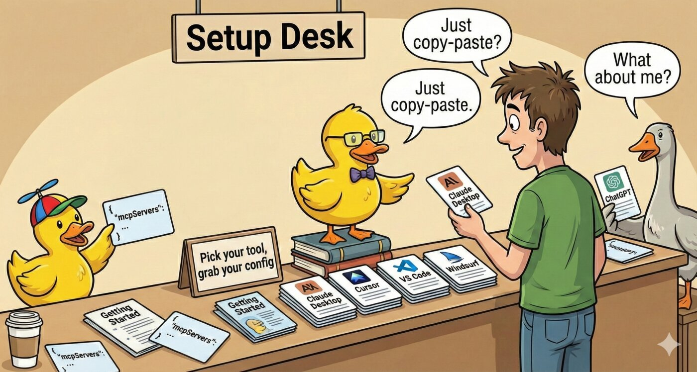

# Setup Guide

<p align="center">
  
</p>

Add mcp-rubber-duck to your AI coding tool. Pick your tool below, copy the config, and you're done.

## Install

Choose one:

```bash
# Option A: Global install (recommended)
npm install -g mcp-rubber-duck

# Option B: No install needed — use npx in your config (see templates below)
```

## Choose Your Tool

- [Claude Desktop](#claude-desktop)
- [Claude Code](#claude-code)
- [Cursor](#cursor)
- [Windsurf](#windsurf)
- [VS Code](#vs-code)
- [Continue](#continue)
- [ChatGPT](#chatgpt)

---

## Claude Desktop

**Config file:**
- macOS: `~/Library/Application Support/Claude/claude_desktop_config.json`
- Windows: `%APPDATA%\Claude\claude_desktop_config.json`
- Linux: `~/.config/Claude/claude_desktop_config.json`

```json
{
  "mcpServers": {
    "rubber-duck": {
      "command": "npx",
      "args": ["-y", "mcp-rubber-duck"],
      "env": {
        "MCP_SERVER": "true",
        "OPENAI_API_KEY": "sk-your-key-here",
        "DEFAULT_PROVIDER": "openai"
      }
    }
  }
}
```

If installed globally, replace `"command": "npx"` and `"args"` with just `"command": "mcp-rubber-duck"`.

**After editing:** Fully quit Claude Desktop (Cmd+Q / Alt+F4) and relaunch.

See also: [Claude Desktop detailed guide](./claude-desktop.md)

---

## Claude Code

**Preferred method** — use the CLI:

```bash
claude mcp add --scope user rubber-duck -- npx -y mcp-rubber-duck
```

Then edit `~/.claude.json` to add env vars to the entry that was just created:

```json
{
  "mcpServers": {
    "rubber-duck": {
      "command": "npx",
      "args": ["-y", "mcp-rubber-duck"],
      "env": {
        "MCP_SERVER": "true",
        "OPENAI_API_KEY": "sk-your-key-here",
        "DEFAULT_PROVIDER": "openai"
      }
    }
  }
}
```

For **project scope** (shared with your team), use `--scope project` which writes to `.mcp.json` at the project root. Avoid committing API keys — use shell environment variables instead.

**After editing:** Start a new Claude Code session.

---

## Cursor

**Config file:**
- Project scope: `.cursor/mcp.json` (in project root)
- Global scope: `~/.cursor/mcp.json`

```json
{
  "mcpServers": {
    "rubber-duck": {
      "command": "npx",
      "args": ["-y", "mcp-rubber-duck"],
      "env": {
        "MCP_SERVER": "true",
        "OPENAI_API_KEY": "sk-your-key-here",
        "DEFAULT_PROVIDER": "openai"
      }
    }
  }
}
```

**After editing:** Reload window (Cmd+Shift+P → "Reload Window").

---

## Windsurf

**Config file:** `~/.codeium/windsurf/mcp_config.json`

Windsurf supports `${env:VAR_NAME}` syntax — set keys in your shell profile instead of hardcoding them:

```json
{
  "mcpServers": {
    "rubber-duck": {
      "command": "npx",
      "args": ["-y", "mcp-rubber-duck"],
      "env": {
        "MCP_SERVER": "true",
        "OPENAI_API_KEY": "${env:OPENAI_API_KEY}",
        "DEFAULT_PROVIDER": "openai"
      }
    }
  }
}
```

Then add to your `~/.zshrc` or `~/.bashrc`:
```bash
export OPENAI_API_KEY="sk-your-key-here"
```

**After editing:** Reload window or restart Windsurf.

---

## VS Code

**Config file:** `.vscode/mcp.json` (in project root)

> **Important:** VS Code uses `"servers"`, not `"mcpServers"`.

VS Code also supports `${env:VAR_NAME}` syntax:

```json
{
  "servers": {
    "rubber-duck": {
      "command": "npx",
      "args": ["-y", "mcp-rubber-duck"],
      "env": {
        "MCP_SERVER": "true",
        "OPENAI_API_KEY": "${env:OPENAI_API_KEY}",
        "DEFAULT_PROVIDER": "openai"
      }
    }
  }
}
```

Requires the GitHub Copilot extension with agent mode enabled.

**After editing:** Reload window (Cmd+Shift+P → "Reload Window").

---

## Continue

**Config file:** `.continue/config.yaml` (project or `~/.continue/config.yaml` for global)

> **Note:** Continue uses YAML, and `mcpServers` is an **array** (not an object).

```yaml
mcpServers:
  - name: rubber-duck
    command: npx
    args:
      - "-y"
      - mcp-rubber-duck
    env:
      MCP_SERVER: "true"
      OPENAI_API_KEY: sk-your-key-here
      DEFAULT_PROVIDER: openai
```

**After editing:** Reload the Continue extension.

---

## ChatGPT

ChatGPT doesn't use a config file. Add MCP servers through the UI:

1. Open ChatGPT settings
2. Enable Developer Mode
3. Click "Add MCP Server"
4. Enter the server details

---

## Adding More Providers

Add any of these to the `env` block in your config:

```json
"GEMINI_API_KEY": "your-gemini-key",
"GROQ_API_KEY": "gsk_your-groq-key",
"OLLAMA_BASE_URL": "http://localhost:11434/v1",
"CLI_CLAUDE_ENABLED": "true",
"CLI_CODEX_ENABLED": "true"
```

See [Configuration](./configuration.md) for the full reference and [Provider Setup](./provider-setup.md) for per-provider instructions.

---

## Verify It Works

After restarting your tool, test the connection:

1. Ask your AI to use the `list_ducks` tool with `check_health: true`
2. You should see your configured providers listed as healthy
3. Try `ask_duck` with a simple prompt to confirm responses work

---

## Troubleshooting

| Problem | Fix |
|---------|-----|
| Server doesn't appear / no tools | Add `"MCP_SERVER": "true"` to the env block |
| "command not found" | Install globally (`npm i -g mcp-rubber-duck`) or use the npx config |
| 401 / API key error | Check key format (OpenAI: `sk-...`, Groq: `gsk_...`) |
| JSON parse error | Validate JSON — no trailing commas, use double quotes |
| VS Code: tools don't appear | Use `"servers"` key, not `"mcpServers"` |
| Changes not taking effect | Fully restart the tool (quit + relaunch for desktop apps) |

See [Claude Desktop troubleshooting](./claude-desktop.md#troubleshooting) for more details.
