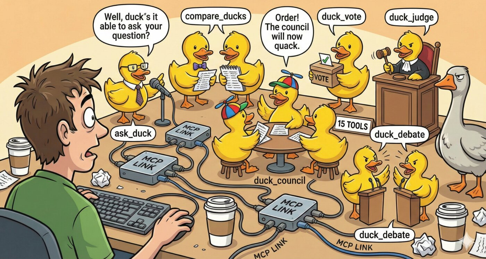

# Available Tools

<p align="center">
  
</p>

## Basic Tools

### ask_duck
Ask a single question to a specific LLM provider. When MCP Bridge is enabled, ducks can automatically access tools from connected MCP servers.

```typescript
{
  "prompt": "What is rubber duck debugging?",
  "provider": "openai",  // Optional, uses default if not specified
  "temperature": 0.7     // Optional
}
```

### chat_with_duck
Have a conversation with context maintained across messages.

```typescript
{
  "conversation_id": "debug-session-1",
  "message": "Can you help me debug this code?",
  "provider": "groq"  // Optional, can switch providers mid-conversation
}
```

### clear_conversations
Clear all conversation history and start fresh. Useful when switching topics or when context becomes too large.

```typescript
{
  // No parameters required
}
```

### list_ducks
List all configured providers and their health status.

```typescript
{
  "check_health": true  // Optional, performs fresh health check
}
```

### list_models
List available models for LLM providers.

```typescript
{
  "provider": "openai",     // Optional, lists all if not specified
  "fetch_latest": false     // Optional, fetch latest from API vs cached
}
```

### compare_ducks
Ask the same question to multiple providers simultaneously. Renders an [interactive UI](../README.md#interactive-uis-mcp-apps) in supported clients.

```typescript
{
  "prompt": "What's the best programming language?",
  "providers": ["openai", "groq", "ollama"]  // Optional, uses all if not specified
}
```

### duck_council
Get responses from all configured ducks - like a panel discussion!

```typescript
{
  "prompt": "How should I architect a microservices application?"
}
```

### get_usage_stats
Get usage statistics and estimated costs for your duck queries. Renders an [interactive UI](../README.md#interactive-uis-mcp-apps) in supported clients.

```typescript
{
  "period": "today"  // Optional: "today", "7d", "30d", or "all"
}
```

Returns requests, tokens (prompt/completion), errors, and estimated costs broken down by provider and model.

Usage data is stored in `~/.mcp-rubber-duck/data/usage.json`.

## Multi-Agent Consensus & Debate Tools

Research-backed tools for multi-agent coordination.

### duck_vote
Have multiple ducks vote on options with reasoning and confidence scores. Renders an [interactive UI](../README.md#interactive-uis-mcp-apps) in supported clients.

```typescript
{
  "question": "Best approach for error handling?",
  "options": ["try-catch", "Result type", "Either monad"],
  "voters": ["openai", "gemini"],     // Optional, uses all if not specified
  "require_reasoning": true            // Optional, default: true
}
```

Returns vote tally, confidence scores, and consensus level (unanimous, majority, plurality, split, none).

### duck_judge
Have one duck evaluate and rank other ducks' responses. Use after `duck_council`.

```typescript
{
  "responses": [/* responses from duck_council */],
  "judge": "openai",                   // Optional, uses first available
  "criteria": ["accuracy", "completeness", "clarity"],  // Optional
  "persona": "senior engineer"         // Optional, e.g., "security expert"
}
```

### duck_iterate
Iteratively refine a response between two ducks.

```typescript
{
  "prompt": "Write a function to validate email addresses",
  "providers": ["openai", "gemini"],   // Exactly 2 providers
  "mode": "critique-improve",          // or "refine"
  "iterations": 3                      // Optional, default: 3, max: 10
}
```

Modes:
- **refine**: Each duck improves the previous response
- **critique-improve**: Alternates between critiquing and improving

### duck_debate
Structured multi-round debate between ducks. Renders an [interactive UI](../README.md#interactive-uis-mcp-apps) in supported clients.

```typescript
{
  "prompt": "Should startups use microservices or monolith for MVP?",
  "format": "oxford",                  // "oxford", "socratic", or "adversarial"
  "rounds": 2,                         // Optional, default: 3
  "providers": ["openai", "gemini"],   // Optional, uses all if not specified
  "synthesizer": "openai"              // Optional, duck to synthesize debate
}
```

Formats:
- **oxford**: Structured pro/con arguments
- **socratic**: Question-based philosophical exploration
- **adversarial**: One defends, others attack weaknesses

## MCP Bridge Tools

Tools for managing MCP server connections and tool approvals.

### mcp_status
Get status of MCP Bridge, connected servers, and pending approvals.

```typescript
{
  // No parameters required
}
```

### get_pending_approvals
Get list of pending MCP tool approvals from ducks.

```typescript
{
  "duck": "openai"  // Optional, filter by duck name
}
```

### approve_mcp_request
Approve or deny a duck's MCP tool request.

```typescript
{
  "approval_id": "abc123",       // Required
  "decision": "approve",         // "approve" or "deny"
  "reason": "Not needed"         // Optional, reason for denial
}
```
